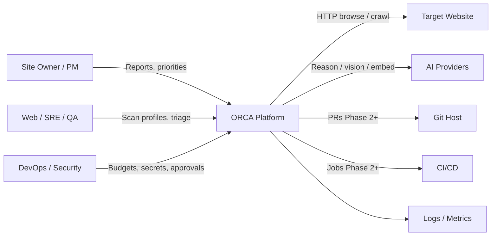
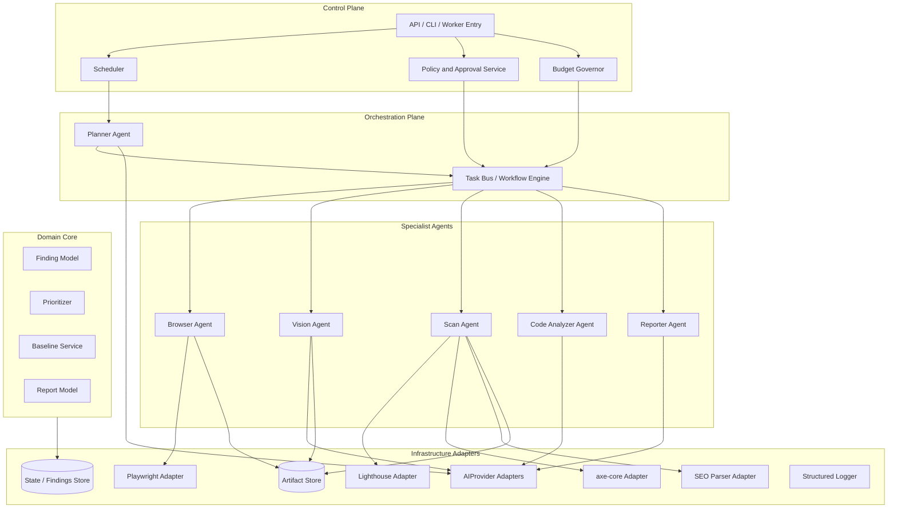
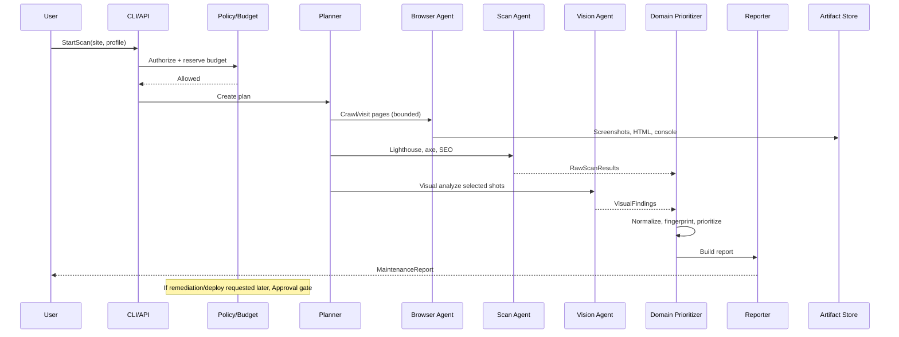
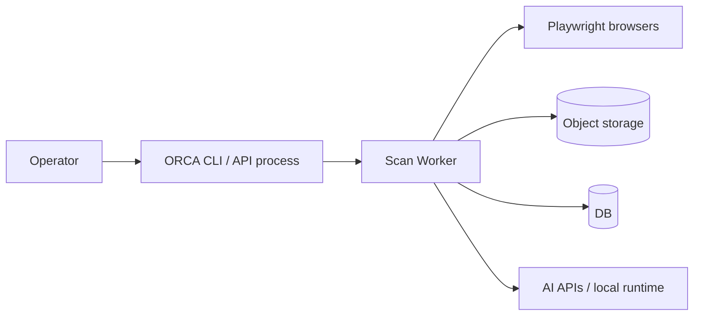

# System Architecture
## AI Website Reliability Engineer (ORCA)

| Field | Value |
|---|---|
| Product name | AI Website Reliability Engineer (ORCA) |
| Document type | System Architecture |
| Version | 0.2 |
| Status | Approved principles; MVP topology superseded by `04_High_Level_Design.md` v2.0 |
| Upstream | `01_Product_Requirements.md` v0.2; `02_User_Stories.md` v0.2; `04_High_Level_Design.md` v2.0 (binding) |
| Audience | Software, AI, DevOps, QA, Product |
| Last updated | 2026-08-06 |
| File | 03_System_Architecture.md |

---

## 1. Purpose

This document retains ORCA’s Clean Architecture, ports/adapters, dependency direction, and replaceability principles.

For the focused read-only Website Analysis MVP, `04_High_Level_Design.md` v2.0 is the binding architecture. Its S1–S17 catalog, scope, flow, terminology, and downstream decisions supersede any conflicting container, agent, vision, baseline, VCS, approval, or deployment content here.

---

## 2. Architecture Summary

ORCA is a **job-oriented, multi-agent reliability platform**:

1. An **Experience Edge** accepts analysis requests and provides status, preview, and HTML/Markdown downloads.
2. An **Orchestrator** validates targets, reserves limits, plans bounded crawl work, and coordinates agents.
3. **S5–S12 agents** analyze SEO, performance, latency, links, console, HTML, security, and accessibility.
4. A **Domain Core** owns evidence invariants, deduplication, severity/confidence, scoring, and policy.
5. **Ports/adapters** isolate browsers, deterministic tools, assistive LLMs, persistence, and reporting.

**Architectural style:** Clean Architecture + hexagonal ports/adapters + bounded multi-agent orchestration.

**Core principle:** Domain never imports OpenAI/Anthropic/Gemini/Ollama SDKs or Playwright directly. All side effects cross explicit ports.

---

## 3. Architectural Principles

| # | Principle | Implication |
|---|---|---|
| P1 | Clean Architecture | Dependencies point inward to domain |
| P2 | SOLID + DI | Every collaborator injected; no hidden singletons |
| P3 | Provider interchangeability | `LlmAssistPort` is the MVP model boundary |
| P4 | Deterministic where possible | Lighthouse/axe/SEO run outside the LLM |
| P5 | Cost bounded | Page/browser/tool/screenshot/token limits hard-stop new work |
| P6 | Read-only MVP | Mutation/VCS/deploy capabilities are structurally absent |
| P7 | Fail partial, not silent | Partial reports preferred over swallowed errors |
| P8 | Observability by default | Structured logs + correlation IDs on every run |
| P9 | Replaceable modules | Browser, tools, storage, queue, and LLM adapters are swappable |
| P10 | Production completeness | No placeholder adapters; each HLD agent is independently testable |

---

## 4. Context (C4 Level 1)



**External systems**

| System | Role | MVP |
|---|---|---|
| Target website(s) | Subject under test | Required |
| AI providers | Reasoning, vision, classification, embeddings | Required (embeddings may be Phase 2) |
| Object/file storage | Screenshots, HTML snapshots, artifacts | Required |
| Secret store / env | API keys, auth material | Required |
| Git host | PR creation | Phase 2 |
| Issue tracker / chat | Notifications | Future |
| PageSpeed Insights API | Optional perf signal | Optional MVP |

---

## 5. Container View (C4 Level 2)

> **Historical pre-HLD reference:** this diagram is not the MVP container catalog. Implement HLD §5, §6, and §13; Vision, Code Analyzer, scheduler/baseline, VCS, and approval paths shown below are Phase 2+ only.



---

## 6. Clean Architecture Layers

### 6.1 Layer map

| Layer | Responsibility | Allowed dependencies |
|---|---|---|
| **Domain** | Entities, value objects, domain services (`AnalysisRun`, Finding, Evidence, Severity) | None outward |
| **Application** | Start/status analysis, coordinate agents, aggregate, publish reports | Domain + ports |
| **Adapters (Inbound)** | Versioned HTTP API and thin UI | Application |
| **Adapters (Outbound)** | Browser/tools, `LlmAssistPort`, S3-compatible store, PostgreSQL | Application ports |
| **Composition Root** | Wiring, config loading, DI container | All (bootstrap only) |

### 6.2 Critical dependency rule

```
Adapters → Application → Domain
                ↘ Ports (interfaces) ← Adapters implement
```

**Forbidden:** Domain or Application importing vendor SDKs.

---

## 7. Long-term Multi-Agent Topology (not MVP-authoritative)

### 7.1 Agent responsibilities

| Agent | Responsibility | Inputs | Outputs | MVP depth |
|---|---|---|---|---|
| **Planner** | Build bounded scan plan under budgets/limits | Site profile, prior baselines | Task graph | Real |
| **Browser** | Navigate, screenshot, console capture, link discovery | URLs, auth profile | PageEvidence | Real |
| **Scan** | Deterministic perf/a11y/SEO | PageEvidence / URL | RawScanResults | Real |
| **Vision** | Visual defect detection from screenshots | Screenshots + brand rules | VisualFindings | Phase 2 |
| **Code Analyzer** | Map findings to likely code causes / patch hints | Findings + optional repo context | RemediationHints | Stub / Phase 2 |
| **Reporter** | Aggregate, prioritize, narrate report | All findings | MaintenanceReport | Real |

### 7.2 Collaboration model

- **Orchestrated, not free-chat swarm:** Planner emits a task graph; workers execute; results merge in domain services.
- **No agent may self-escalate privileges:** Policy service is outside agents.
- **Shared memory:** ScanRun aggregate + artifact store; not unbounded conversational memory.
- **Recursion depth limit:** Planner may replan only within configured depth.

### 7.3 Why multi-agent (not monolith)

| Concern | Multi-agent benefit |
|---|---|
| Scalability | Parallel page/scan/vision workers |
| Reliability | Isolate browser flakiness from report generation |
| Maintainability | Swap vision or browser adapter independently |
| Cost | Route triage to mini models; heavy reasoning only where needed |
| Safety | Narrow tool permissions per agent |

---

## 8. Core Domain Model (logical)

### 8.1 Aggregates / entities (conceptual)

| Concept | Description |
|---|---|
| `TargetUrl` | Validated public HTTP(S) target |
| `ScanPreferences` | Page/depth/device/agent limits and optional toggles |
| `AnalysisRun` | Tenant-scoped execution with state, coverage, correlation ID |
| `PageEvidence` | URL, screenshot refs, console logs, HTML hash |
| `Finding` | Normalized issue with category, severity, evidence, fingerprint |
| `Evidence` | Immutable metric/response/DOM/console/screenshot/tool reference |
| `ScanSummary` | Health score, grouped counts, coverage, limitations, failures |
| `ReportArtifact` | Immutable HTML or Markdown tenant-authorized download |
| `BudgetUsage` | Pages, browser minutes, PSI, screenshots, and LLM tokens per run |

### 8.2 Finding categories (binding MVP mapping)

SEO · Performance · Latency · BrokenLink · Console · HTML · Security · Accessibility

### 8.3 Fingerprinting

Each finding gets a stable `fingerprint` (category + normalized locator/signal) to support dedupe and future baselines.

---

## 9. Historical End-to-End Flow (superseded for MVP)

The following pre-HLD flow is retained only as roadmap context. Binding MVP execution is HLD §8 and contains no Vision or remediation/deploy path.



---

## 10. AI Architecture Boundary

### 10.1 MVP `LlmAssistPort`

MVP model calls use typed assistive capabilities only:

- explain supplied evidence-backed findings;
- suggest deduplication groups without authoritative mutation;
- generate narrative referencing existing finding IDs.

Vision, embeddings, code generation, and autonomous tool use are Phase 2+ and absent from MVP adapters.

### 10.2 Provider adapters (supported targets)

OpenAI · Anthropic · Gemini · Ollama · LM Studio · Future (vLLM, etc.)

### 10.3 Model routing (capability map — not hard SKUs)

| Task | Capability tier | Notes |
|---|---|---|
| Finding explanation / report narrative | Reasoning | Assistive; evidence-grounded |
| Deduplication suggestion | Structured text | Domain validation authoritative |
| Code patch suggestions | Reasoning + code | Phase 2 |
| Historical similarity | Embeddings | Phase 2 |

Exact model IDs live in config, never domain code.

### 10.4 Prompt management

- Prompts stored under external config (e.g., `config/prompts/`)
- Versioned; referenced by name + version in logs
- No business rules embedded solely inside prompts when they belong in domain policy

---

## 11. Policy, Guardrails, and Approvals

### 11.1 Policy engine placement

Policy sits in **Control Plane**, not inside LLM tools:

| Action class | Examples | Enforcement |
|---|---|---|
| Allowed | Read pages, screenshot, Lighthouse, axe, SEO, console, report, suggest | Auto if budget OK |
| Approval required | Deploy, merge PR, modify prod, DNS, DB, publish content | Hard block until approval record |
| Never | Arbitrary prod shell, rotate secrets, expose env, billing/auth settings | Unconditional deny + alert |

### 11.2 Operational governors

| Governor | Enforces |
|---|---|
| PageScanLimit | Max pages/depth |
| ApiBudget | Token/$ caps |
| TimeoutPolicy | Per-task and run deadlines |
| RetryPolicy | Bounded retries |
| ConfidenceGate | Min confidence before auto-include / later auto-act |
| RecursionDepth | Planner replans |

---

## 12. Data Architecture

### 12.1 Data stores

| Store | Contents | MVP |
|---|---|---|
| Operational DB | Sites, runs, findings, reports metadata | Yes |
| Artifact object store | Screenshots, HTML snapshots, Lighthouse JSON | Yes |
| Vector index | Embedding similarity | Phase 2 |
| Secrets | Provider keys, site auth | Env/secret manager |

### 12.2 Retention (default policy — finalize in Security doc)

- Artifacts retained per configured TTL
- Logs scrubbed of secrets; optional PII redaction hooks
- Approval records retained longer for audit

### 12.3 Consistency model

- ScanRun is source of truth for a job
- Artifacts immutable once written
- Report is a point-in-time projection of findings for that run

---

## 13. Technology Stack (architectural choices)

| Concern | Choice | Rationale |
|---|---|---|
| Browser automation | Playwright (+ optional Browserbase/Stagehand later) | Reliable modern browser control |
| Performance | Lighthouse (+ optional PageSpeed Insights) | Industry-standard lab metrics |
| Accessibility | axe-core | Deterministic a11y rules |
| SEO | DOM/metadata parsers | Cheap, explainable |
| Orchestration | In-process workflow MVP → queue workers later | YAGNI then scale |
| AI access | `LlmAssistPort` adapters | Assistive-only vendor independence |
| Language/runtime | Deferred to Low Level Design (Python preferred given agent/tooling ecosystem unless team standard differs) | Document decision in ADR |
| Config | Env + config files | No hardcoded secrets |
| Logging | Structured JSON logs | Enterprise ops |

---

## 14. Deployment Architecture

### 14.1 MVP deployment topology



**MVP:** deployment may be small, but tenant identity and isolation remain mandatory in API, metadata, artifacts, browser contexts, and downloads.  
**Current deployment authority:** HLD §13 plus approved `08`, `10`, and pending `14`; this older topology is non-normative.

### 14.2 Environment separation

| Env | Purpose |
|---|---|
| Dev | Local fixtures / reference sites |
| Staging | Customer staging URLs |
| Prod (ORCA control plane) | Runs against agreed targets; still cannot mutate target prod without approval |

---

## 15. Integration Architecture

| Integration | Direction | Phase |
|---|---|---|
| Website HTTP(S) | Outbound | MVP |
| AI providers | Outbound | MVP |
| Object storage | Outbound | MVP |
| Git host PR API | Outbound | Phase 2 |
| CI status checks | Bidirectional | Phase 2/3 |
| Slack/Teams/Email | Outbound notify | Future |
| Issue trackers | Outbound tickets | Future |

**Rule:** Never invent APIs; use documented SDKs/official HTTP APIs only.

---

## 16. Cross-Cutting Concerns

### 16.1 Observability

- Correlation ID = `scan_run_id`
- Log agent name, task id, page url (redacted query secrets), model alias (not key), latency, token usage
- Metrics: run success/partial/fail, cost, page count, finding counts by category

### 16.2 Error handling

- Transient → retry policy
- Permanent page failure → record page error finding/evidence gap; continue run
- Budget exhaustion → stop new AI/browser tasks; finalize partial report
- Policy deny → structured `PolicyViolation` event

### 16.3 Security (architecture-level)

- Least-privilege credentials per adapter
- Network egress allowlists where feasible
- Tool permission matrix per agent
- Prompt injection treated as untrusted content from pages; never elevate to policy override

### 16.4 Performance & cost controls

- Reuse browser context/session when safe
- Screenshot only for pages selected by planner/rules
- Cache identical artifact hashes within TTL
- Batch classification prompts when possible

---

## 17. Phased Architecture Evolution

| Phase | Architecture emphasis |
|---|---|
| **Phase 1 MVP** | HLD S1–S17 read-only analysis; eight agents; HTML/Markdown reports; no Vision/VCS/deploy |
| **Phase 2** | Vision, baselines, embeddings, Code Analyzer depth, PR adapter, authenticated target profiles |
| **Phase 3** | Test runner integration, approval-gated deploy adapter, distributed workers |

Ports for Phase 2/3 exist early as interfaces (or no-op adapters) **only where needed to preserve boundaries** — no fake product features.

---

## 18. Quality Attribute Scenarios

| QA | Scenario | Response |
|---|---|---|
| Cost | Token spike mid-run | Budget governor halts AI tasks; partial report |
| Reliability | 10% pages timeout | Continue; mark gaps; still publish report |
| Security | Model requests “deploy now” | Policy deny; no tool exposed |
| Maintainability | Swap OpenAI → Anthropic | Config + adapter change only |
| Scalability | 50 sites nightly | Queue + N workers (post-MVP) |
| Usability | PM reads report | Executive summary + Top N + evidence links |

---

## 19. Architecture Decision Records (index)

| ADR | Decision | Status |
|---|---|---|
| ADR-001 | Position as multi-agent WRE, not monolithic chatbot | Accepted (PRD) |
| ADR-002 | Clean Architecture + MVP `LlmAssistPort` | Accepted; HLD/AI Architecture |
| ADR-003 | Deterministic scanners outside LLM | Accepted |
| ADR-004 | Human approval for high-impact actions | Accepted (PRD) |
| ADR-005 | Cost-first optimization order | Accepted (PRD) |
| ADR-006 | MVP in-process orchestration before distributed queue | Accepted |
| ADR-007 | Artifacts immutable in object store | Accepted |
| ADR-008 | Prompts externalized in config | Accepted |

Full ADR write-ups belong in `docs/adrs/` after later documentation approval.

---

## 20. Out-of-Scope Architecturally (aligned to Non-Goals)

- Replacing APM/infra monitoring
- Autonomous production mutation
- Embedding business logic in vendor-specific SDK calls
- Unbounded crawl/AI spend architectures

---

## 21. Open Architecture Questions

1. Primary MVP entrypoint: CLI-only vs thin API?
2. DB choice for MVP (SQLite vs Postgres)?
3. Artifact store local filesystem vs S3-compatible from day one?
4. Stagehand/Browserbase in MVP or Playwright-only?
5. Must local model path (Ollama/LM Studio) be runnable in MVP, or interface-ready only?

---

## 22. Downstream Documents

See [00_Documentation_Index.md](00_Documentation_Index.md) for the mandatory creation order (01–15).

---

## Document approval

| Role | Name | Decision | Date |
|---|---|---|---|
| Product | | Approved | 2026-07-24 |
| Engineering Architect | | Approved | 2026-07-24 |
| AI Engineering | | Approved | 2026-07-24 |
| DevOps / Security | | Approved | 2026-07-24 |
| QA | | Approved | 2026-07-24 |
