# High Level Design (HLD)
## AI Website Health Orchestrator Agent

---

## 1. Document Metadata

| Field | Value |
|---|---|
| **Product Name** | AI Website Health Orchestrator Agent |
| **Alternate / portfolio name** | AI Website Reliability Engineer (ORCA) — analysis MVP delivery |
| **Document Type** | High Level Design (HLD) |
| **Document ID** | ORCA-HLD-004 |
| **Version** | 2.0 |
| **Status** | Approved |
| **Scope** | Website Analysis MVP (read-only) |
| **Source of truth** | `HLD_WEB_Agent_Focused_MVP_v2.docx` (imported and expanded herein) |
| **Audience** | Software Engineers, AI Engineers, DevOps/Platform Engineers, QA Engineers, Product Managers, Security Reviewers |
| **Last Updated** | 2026-07-30 |
| **File** | `04_High_Level_Design.md` |

### Upstream documents

| Document | Status | Relationship to this HLD |
|---|---|---|
| `HLD_WEB_Agent_Focused_MVP_v2.docx` | Authoritative MVP HLD source | Normative for MVP architecture, agents, report/download model, and out-of-scope |
| `01_Product_Requirements.md` | Approved | Product intent; **MVP delivery scope is narrowed by this HLD** (read-only analysis; no Git/PR/deploy in MVP) |
| `02_User_Stories.md` | Approved | Backlog; MVP stories that imply Git/PR/deploy are deferred beyond this HLD’s MVP boundary |
| `03_System_Architecture.md` | Approved | Style (Clean Architecture, ports/adapters) retained; container/agent catalog **superseded for MVP by this HLD** |

### Downstream documents

| Document | Expectation |
|---|---|
| `05_Low_Level_Design.md` | Module design for Orchestrator + specialised agents + report generator |
| `06_API_Specification.md` | Submit scan, status, preview, download HTML/Markdown |
| `07_Agent_Architecture.md` | Agent contracts, parallelism, tool permissions |
| `08_Database_Design.md` | Scan metadata, findings, artifacts, tenant isolation |
| `09_AI_Architecture.md` | LLM for explanation/dedup/narrative only — not primary evidence |
| `10_Security.md` | SSRF, TLS, isolation, secret masking, retention |
| `11_Guardrails.md` | Allow/deny targets, crawl limits, cost limits |
| `12_Implementation_Plan.md` | MVP work packages by agent |
| `13_Testing_Strategy.md` | Agent, orchestration, report, SSRF, partial-failure tests |
| `14_Deployment.md` | Browser isolation, egress controls, multi-tenant runtime |
| `15_Cost_Optimization.md` | Page, browser-minute, PSI, screenshot, LLM token limits |

### Normative statement

> **This HLD (v2.0) is the binding architecture for the Website Analysis MVP.**  
> Where earlier docs describe GitHub integration, pull requests, patches, or deployment as near-term capabilities, those capabilities are **out of scope for MVP** per §9 and must not appear in MVP LLD/API/implementation.

---

## 2. Purpose

This High Level Design describes an **Orchestrator Agent** that coordinates **specialised Web Agents** to analyse the current condition of a **public website**.

The MVP focuses on:

1. Identifying measurable website problems  
2. Collecting evidence for every finding  
3. Prioritising findings  
4. Producing a **downloadable** report (HTML and Markdown)

The MVP **does not**:

- Modify the website  
- Connect to source control  
- Create pull requests  
- Deploy fixes  

The user provides a website URL and scan preferences. The orchestrator creates a scan plan, invokes the relevant agents, tracks execution, consolidates duplicate findings, assigns severity and confidence, and generates the final report.

This document is written at **architecture level** (not implementation): enough detail for Low Level Design, without code, class diagrams, database schemas, or concrete API payloads.

---

## 3. Design Goals

| ID | Goal | Architectural implication |
|---|---|---|
| DG-01 | **Measurable problem detection** | Specialised agents own SEO, performance, latency, broken links, console, HTML, security, and basic accessibility |
| DG-02 | **Evidence for every finding** | No finding without URL and at least one evidence artifact (metric, response detail, DOM snippet, console message, or screenshot ref) |
| DG-03 | **Parallel analysis** | Independent scanners run concurrently where safe to reduce wall-clock time |
| DG-04 | **Downloadable health report** | Report Generator produces HTML and Markdown; preview + download without GitHub |
| DG-05 | **Read-only MVP** | No write path to target site, VCS, or deploy systems in MVP |
| DG-06 | **Deterministic evidence first** | Playwright, Lighthouse, axe-core, HTML analysis, and secret rules are primary evidence; LLM assists explanation/dedup/narrative only |
| DG-07 | **Safe targeting** | SSRF protection, allow/deny policies, restricted egress, browser isolation |
| DG-08 | **Bounded cost** | Hard limits for pages, browser minutes, PSI calls, screenshots, LLM tokens |
| DG-09 | **Partial success** | Retries, timeouts, agent-level failure reporting, partial scan completion with explicit limitations |
| DG-10 | **Tenant isolation** | Scan metadata, artifacts, and downloadable reports isolated by tenant |
| DG-11 | **Clean Architecture** | Orchestration and domain ranking independent of tool/vendor adapters (ports & adapters) |

---

## 4. System Context

### 4.1 Context statement

The system sits between the **user** and the **target website**. It uses browser automation and specialised analysis tools to inspect **public pages**. Findings and scan artifacts are stored only for report generation and the configured retention period. The final report is presented in the application and can be downloaded **without requiring a GitHub integration**.

### 4.2 Context diagram

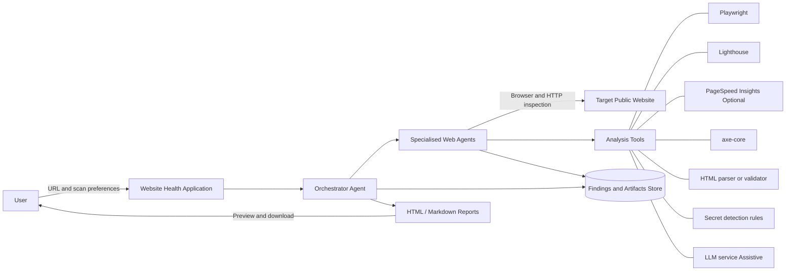

**Figure 1. Focused MVP architecture (logical)**

### 4.3 External systems

| System | Purpose | MVP |
|---|---|---|
| Target public website | Subject under analysis | Required |
| Playwright | Browser rendering, network events, DOM snapshots, screenshots, console | Required |
| Lighthouse | Performance, SEO, selected best-practice metrics | Required |
| PageSpeed Insights API | Optional field/lab performance data when configured | Optional |
| axe-core | Automated accessibility checks in rendered context | Required |
| HTML parser/validator | Document structure and markup analysis | Required |
| Secret detection rules | Pattern/entropy checks for exposed client-side secrets | Required |
| LLM service | Finding explanation, deduplication assistance, prioritised narrative | Required (assistive only) |
| Application UI / download channel | Preview and download HTML/Markdown | Required |
| GitHub / GitLab / source repos | — | **Out of scope** |

### 4.4 Trust posture

| Boundary | Posture |
|---|---|
| User → Application | Authenticated tenant context (multi-tenant isolation) |
| Orchestrator → Target | Outbound only; SSRF-validated; public-site assumption for MVP |
| Page content → LLM | **Untrusted**; cannot override policy, limits, or invent missing scanner evidence |
| LLM → Report | Assistive narrative only; findings remain evidence-backed |
| Artifacts → Downloads | Secret masking mandatory before report inclusion |

---

## 5. Complete Subsystem Catalog

### 5.1 Bounded contexts

| Bounded Context | Subsystems | Responsibility theme |
|---|---|---|
| **Experience** | S1 | User submit, progress, preview, download |
| **Orchestration** | S2, S3, S4 | Plan, dispatch, merge, govern |
| **Acquisition & Analysis** | S5–S12 | Specialised web agents |
| **Reporting** | S13 | Normalise, score, render downloads |
| **Platform** | S14–S17 | Storage, AI assist, security controls, observability |

### 5.2 Subsystems

| ID | Subsystem | Single responsibility | Phase |
|---|---|---|---|
| **S1** | Experience Edge | Accept URL/preferences; show status; preview report; provide HTML/Markdown download actions | **MVP** |
| **S2** | Orchestrator Agent | Validate target; create page/task plan; apply crawl limits; dispatch agents; monitor failures/retries; merge findings; instruct report generation | **MVP** |
| **S3** | Crawl Planner | Discover eligible pages; build scan queue under max pages / depth / device profile | **MVP** |
| **S4** | Target Policy Gate | SSRF checks; allow/deny policies; restricted outbound access decisions | **MVP** |
| **S5** | SEO Agent | Titles, descriptions, canonicals, robots, sitemap presence, headings, structured data, Open Graph/social metadata | **MVP** |
| **S6** | Performance Agent | Home and selected-page load time, Lighthouse metrics, Core Web Vitals, render-blocking resources, unused assets, optimisation opportunities | **MVP** |
| **S7** | Latency Agent | DNS, connection, TLS, TTFB, document response time, slow resources, selected API/network request latency | **MVP** |
| **S8** | Broken Link Agent | Internal/external links, status codes, redirect chains, missing resources, malformed URLs | **MVP** |
| **S9** | Browser Console Agent | JS errors, unhandled promise rejections, failed resource loads, deprecation warnings, relevant browser security messages | **MVP** |
| **S10** | HTML Document Analyzer | Document structure, duplicate/missing tags, heading order, invalid nesting, language, viewport, forms, semantic markup | **MVP** |
| **S11** | Security Agent | Exposed API keys/tokens/credentials in HTML and client-side assets; mixed content; insecure forms; missing security headers | **MVP** |
| **S12** | Accessibility Agent | Basic automated axe-core checks: labels, contrast indications, landmarks, keyboard-related rule violations | **MVP** |
| **S13** | Report Generator | Normalise, deduplicate, score, group findings; render HTML and Markdown reports | **MVP** |
| **S14** | Artifact & Findings Store | Persist findings, evidence refs, screenshots, tool outputs for retention window | **MVP** |
| **S15** | Assistive LLM Gateway | Explanation, dedup assistance, prioritised narrative — **not** primary evidence source | **MVP** |
| **S16** | Cost & Limit Governor | Enforce page, browser-minute, PSI, screenshot, LLM token limits | **MVP** |
| **S17** | Observability | Correlation IDs, durations, failure rates, structured logs | **MVP** |
| **S18** | VCS / PR Integration | Source control and pull requests | **Future — out of MVP** |
| **S19** | Remediation / Deploy | Patches, autonomous fixes, deployment | **Future — out of MVP** |

---

## 6. Logical Component Architecture

### 6.1 Component diagram

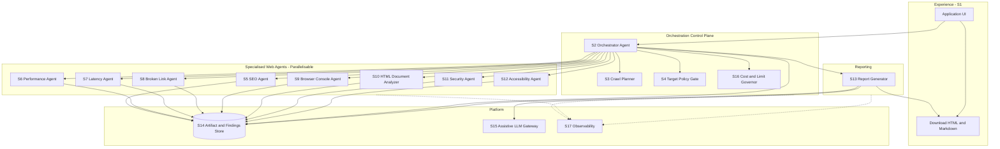

### 6.2 Orchestrator Agent (control plane)

The **Orchestrator Agent** is the control plane for a website analysis run. It:

1. Validates the target (via Target Policy Gate)  
2. Creates the page and task plan (via Crawl Planner)  
3. Applies crawl limits  
4. Dispatches specialised agents (in parallel where possible)  
5. Monitors failures and retries  
6. Merges / consolidates findings  
7. Assigns severity and confidence (with optional LLM assistance)  
8. Instructs the Report Generator to create downloadable output  

### 6.3 Specialised Web Agents

| Agent | Responsibility |
|---|---|
| **SEO Agent** | Titles, descriptions, canonical tags, robots directives, sitemap presence, headings, structured data, Open Graph and social metadata |
| **Performance Agent** | Home-page and selected-page load time, Lighthouse metrics, Core Web Vitals, render-blocking resources, unused assets and optimisation opportunities |
| **Latency Agent** | DNS, connection, TLS, time-to-first-byte, document response time, slow resources and selected API/network request latency |
| **Broken Link Agent** | Internal and external links, status codes, redirect chains, missing resources and malformed URLs |
| **Browser Console Agent** | JavaScript errors, unhandled promise rejections, failed resource loads, deprecation warnings and relevant browser security messages |
| **HTML Document Analyzer** | Document structure, duplicate or missing tags, heading order, invalid nesting, language declaration, viewport settings, forms and semantic markup |
| **Security Agent** | Exposed API keys, tokens or credentials in HTML and client-side assets; mixed content; insecure forms; and missing security headers |
| **Accessibility Agent** | Basic automated checks using axe-core, including labels, contrast indications, landmark issues and keyboard-related rule violations |
| **Report Generator** | Normalises, deduplicates, scores and groups findings, then renders the final HTML and Markdown reports |

**Parallelism rule:** Agents that do not share mutating session state may execute concurrently on the planned page set, subject to Cost & Limit Governor and browser-pool capacity.

---

## 7. Layer Mapping (Clean Architecture)

### 7.1 Layers

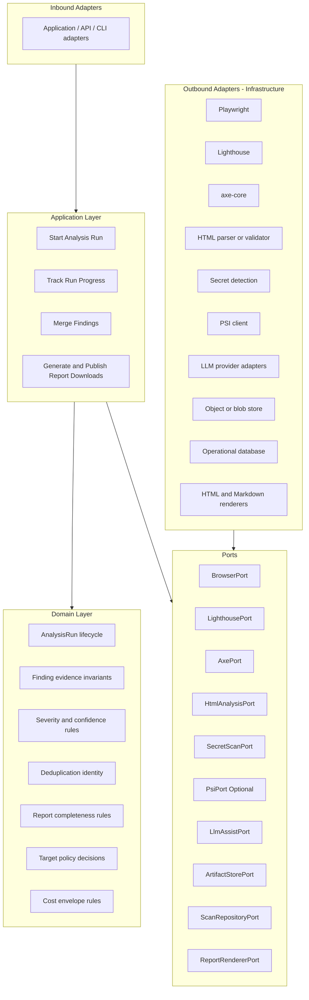

### 7.2 Dependency rule

```text
Inbound Adapters → Application → Domain
                         ↘ Ports ← Outbound Adapters
```

| Must | Must not |
|---|---|
| Domain owns severity/confidence/dedup invariants | Domain import Playwright or vendor LLM SDKs |
| LLM assists narrative/dedup suggestions | LLM invent findings without tool evidence |
| Report Generator requires evidence refs | Ship report that depends on GitHub |

---

## 8. End-to-End Flows

### 8.1 Scan data flow (normative MVP)

1. User submits a public website URL and optional limits (maximum pages, device profile, scan depth).  
2. Orchestrator validates the target and applies SSRF and allow/deny policies.  
3. Crawler discovers eligible pages and builds the scan queue.  
4. Orchestrator invokes browser and specialised agents **in parallel** where possible.  
5. Each agent returns structured findings and evidence to the orchestrator.  
6. Orchestrator deduplicates related findings, calculates priority, and prepares the scan summary.  
7. Report Generator creates both **HTML** and **Markdown** versions.  
8. User reviews the result in the application and downloads the preferred format.

### 8.2 Happy path — sequence

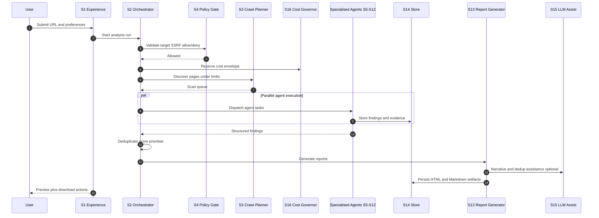

### 8.3 Failure path — target rejected (SSRF / deny)

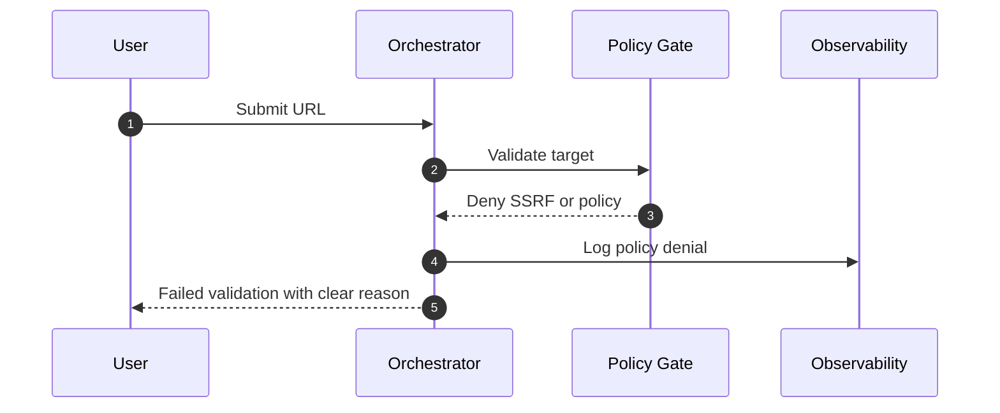

### 8.4 Failure path — agent failure with partial completion

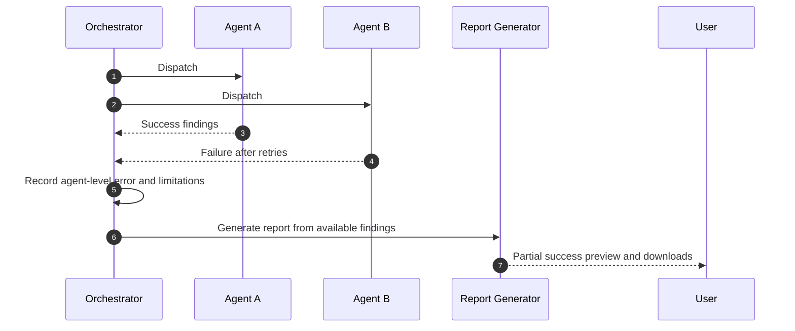

### 8.5 Budget / limit exhaustion

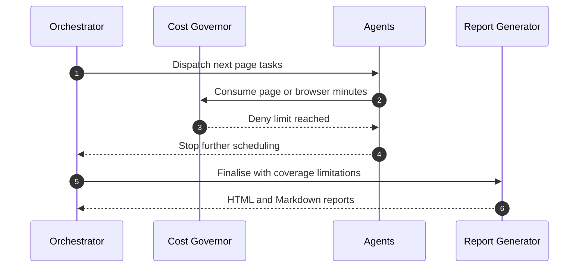

### 8.6 Policy denial of non-MVP actions

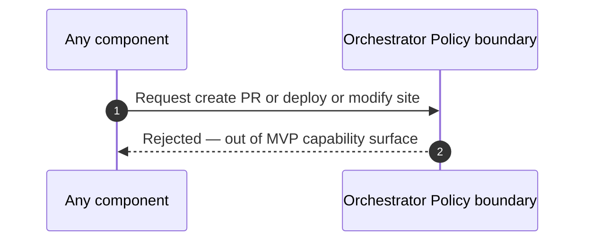

MVP has **no adapters** for VCS/deploy/site mutation. Denial is structural (capability absent) plus explicit guardrails in downstream Security/Guardrails docs.

### 8.7 Future phase flows (not MVP)

Future phases may add repository integration, patch suggestions, PRs, and approval-gated remediation. Those flows are **intentionally unspecified for MVP implementation** and must not be designed into MVP LLD as active paths.

---

## 9. Logical Data Flow

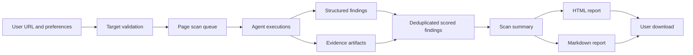

### Logical objects (not schemas)

| Object | Description |
|---|---|
| AnalysisRun | One user-initiated website analysis with correlation ID |
| ScanPreferences | Max pages, device profile, scan depth, optional toggles |
| PageTarget | URL eligible for analysis after crawl rules |
| Finding | Issue with category/agent, severity, confidence, evidence refs |
| Evidence | Metric, response detail, DOM snippet, console message, screenshot ref, tool output ref |
| ScanSummary | Coverage, limitations, errors, timestamps, overall health score |
| ReportArtifact | Immutable HTML and Markdown files for download |

**Evidence invariant:** Every Finding MUST reference at least one Evidence item.

---

## 10. State Machine

### 10.1 AnalysisRun states

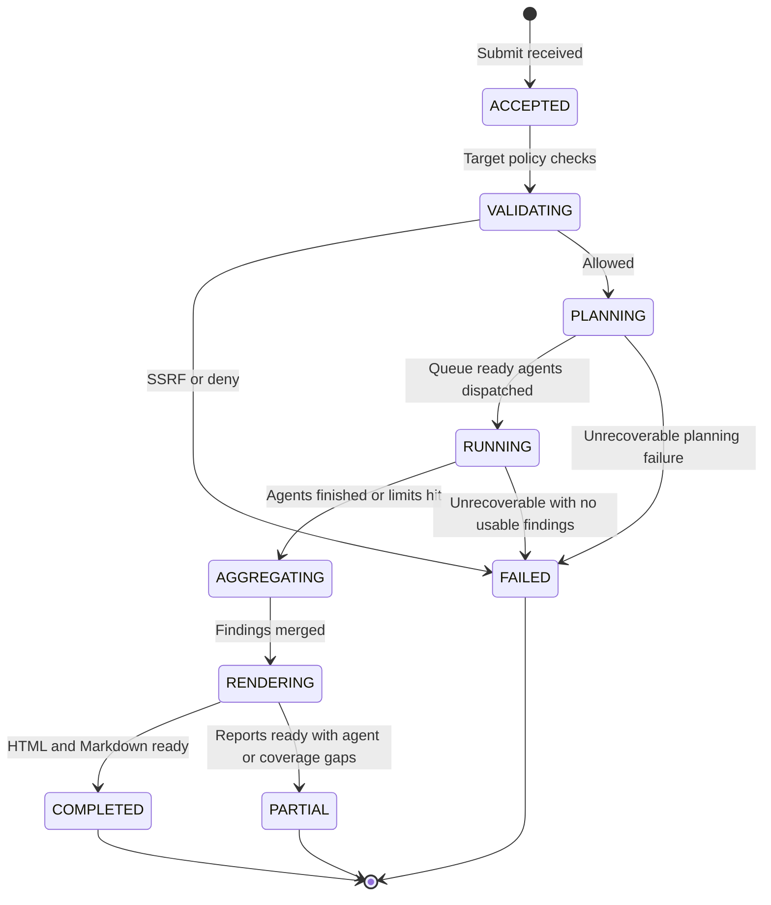

| State | Meaning | Downloads available? |
|---|---|---|
| ACCEPTED | Request accepted | No |
| VALIDATING | SSRF/allow-deny in progress | No |
| PLANNING | Crawl queue construction | No |
| RUNNING | Agents executing | No (status only) |
| AGGREGATING | Merge/dedup/score | No |
| RENDERING | HTML/Markdown generation | No |
| COMPLETED | Success within scope | **Yes** |
| PARTIAL | Usable report with limitations/errors section | **Yes** |
| FAILED | No usable report | No |

---

## 11. Cross-Cutting Concerns

| Concern | Architectural requirements |
|---|---|
| **Security** | TLS in transit; target validation; **SSRF protection**; restricted outbound access; safe browser isolation; **secret masking in reports** |
| **Privacy** | Minimise captured personal information; define retention for screenshots, DOM snapshots, and logs |
| **Reliability** | Retries; timeouts; **partial scan completion**; clear **agent-level failure reporting** |
| **Cost control** | Limits for **pages**, **browser minutes**, **PSI calls**, **screenshots**, and **LLM tokens** |
| **Observability** | Correlation IDs; scan duration; agent duration; failure rate; structured logs |
| **Multi-tenancy** | Isolate scan metadata, artifacts, and downloadable reports **by tenant** |

---

## 12. Technology Decisions

| ID | Decision | Choice | Status |
|---|---|---|---|
| TD-01 | Browser automation | Playwright | **Accepted** |
| TD-02 | Performance / selected SEO lab metrics | Lighthouse | **Accepted** |
| TD-03 | Optional field/lab perf | PageSpeed Insights API when configured | **Accepted (optional)** |
| TD-04 | Accessibility | axe-core in rendered page context | **Accepted** |
| TD-05 | HTML structure analysis | HTML parser/validator | **Accepted** |
| TD-06 | Client-side secret detection | Pattern and entropy-based rules | **Accepted** |
| TD-07 | LLM role | Explanation, dedup assistance, prioritised narrative — **not primary evidence** | **Accepted** |
| TD-08 | MVP output channel | In-app preview + **HTML and Markdown download** (no GitHub) | **Accepted** |
| TD-09 | Agent concurrency | Parallel specialised agents where safe | **Accepted** |
| TD-10 | Architecture style | Clean Architecture + ports/adapters | **Accepted** |
| TD-11 | AI provider wiring | Provider-agnostic assistive gateway | **Accepted** (`09_AI_Architecture.md`) |
| TD-12 | Persistence engines | PostgreSQL + S3-compatible production; SQLite/filesystem local | **Accepted** (`08_Database_Design.md`) |
| TD-13 | Experience surface | Versioned HTTP API + thin web UI | **Accepted** (`06_API_Specification.md`) |

### Integrations summary

| Integration | Purpose |
|---|---|
| Playwright | Browser rendering, network events, DOM snapshots, screenshots, console capture |
| Lighthouse | Performance, SEO, selected best-practice metrics |
| PageSpeed Insights API | Optional field and lab performance data when configured |
| axe-core | Automated accessibility checks in the rendered page context |
| HTML parser/validator | Document structure and markup analysis |
| Secret detection rules | Pattern and entropy-based checks for exposed client-side secrets |
| LLM service | Finding explanation, deduplication assistance, prioritised report narrative; **not the primary evidence source** |

---

## 13. Deployment View

### 13.1 MVP deployment (logical)

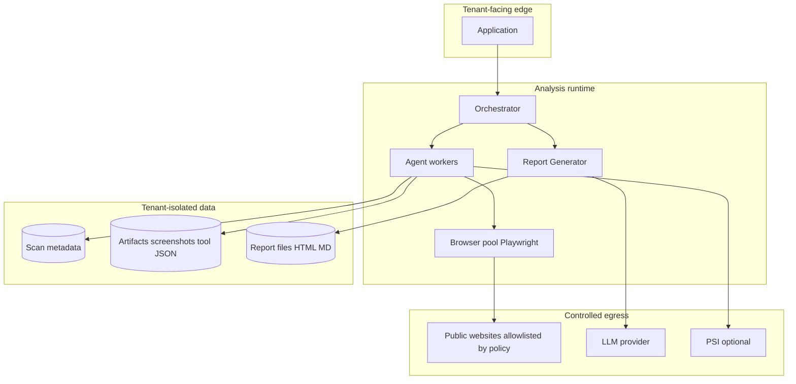

**MVP traits:** read-only analysis; browser isolation; restricted egress; tenant-isolated artifacts/reports.

### 13.2 Future deployment

May add repository connectors, remediation workers, and approval workflows. **Not part of MVP topology.**

---

## 14. Interface Contracts (Logical Ports Only)

| Port | Consumer | Capability |
|---|---|---|
| `BrowserPort` | Console, Latency, SEO/HTML collectors, screenshots | Navigate, network timeline, DOM snapshot, console, screenshot |
| `LighthousePort` | Performance / SEO metrics agent paths | Run lab audit; return metrics + raw artifact |
| `PsiPort` | Performance path (optional) | Fetch PSI data when configured |
| `AxePort` | Accessibility Agent | Run axe-core on rendered page |
| `HtmlAnalysisPort` | HTML Document Analyzer | Structure/markup analysis |
| `SecretScanPort` | Security Agent | Scan HTML/assets for secret patterns/entropy |
| `HeaderProbePort` | Security / Latency paths | Observe security headers and timing signals |
| `LinkCheckPort` | Broken Link Agent | Resolve status/redirects for URLs |
| `LlmAssistPort` | Report Generator / Orchestrator merge assist | Explain, suggest dedup groups, narrative — no authoritative evidence creation |
| `ArtifactStorePort` | Agents, Report Generator | Store/retrieve evidence and report binaries |
| `ScanRepositoryPort` | Orchestrator | Persist run, findings, summary metadata |
| `ReportRendererPort` | Report Generator | Render HTML and Markdown from normalised model |
| `TargetPolicyPort` | Orchestrator | SSRF and allow/deny evaluation |
| `CostGovernorPort` | Orchestrator, agents | Reserve/consume/enforce limits |

No HTTP routes, CLI flags, or code signatures are defined here.

---

## 15. MVP Scope Boundary

### 15.1 In MVP

- Identify **SEO, performance, latency, broken-link, browser-console, HTML-document, security, and basic accessibility** issues  
- Attach **evidence** to every finding  
- Run independent scanners **in parallel** where possible  
- Produce prioritised website health report downloadable as **HTML** and **Markdown**  
- Keep release **read-only** and **independent of GitHub** or any source-code repository  

### 15.2 Report and download (MVP mandatory)

GitHub is **not** required. At the end of each successful or partially successful analysis, the system **must** provide:

- Report **preview** in the application  
- Explicit **download actions** for HTML and Markdown  

| Format | Purpose |
|---|---|
| **HTML report** | Styled, self-contained file for browser viewing and sharing with business/engineering stakeholders |
| **Markdown report** | Portable text for docs, tickets, repositories, and further editing |
| **Optional raw evidence package** | Later phase: JSON findings, screenshots, Lighthouse output, console logs |

**Recommended file names**

- `website-health-report_<domain>_<timestamp>.html`  
- `website-health-report_<domain>_<timestamp>.md`  

### 15.3 Report structure

1. Executive summary and overall health score  
2. Top critical and high-priority issues  
3. Findings grouped by agent/category  
4. Affected URLs and evidence  
5. Impact explanation and recommended remediation  
6. Scan coverage, limitations, errors, and timestamp  

### 15.4 Out of scope for MVP

- GitHub, GitLab, or source-repository integration  
- Automatic code changes, patches, pull requests, or deployment  
- Fully autonomous remediation of detected issues  
- Authenticated application scanning beyond explicitly supported login patterns  
- Legal certification for accessibility, security, or compliance  
- Native mobile application analysis  

### 15.5 Phase framing (post-MVP, non-binding here)

| Phase | Potential themes (not MVP commitments) |
|---|---|
| Later | Raw evidence zip package; deeper auth patterns; scheduling |
| Later | Repository integration and assisted patches/PRs under human control |
| Later | Approval-gated remediation workflows |

---

## 16. Quality Attribute Responses

| Attribute | How architecture satisfies it |
|---|---|
| **Reliability** | Retries, timeouts, agent-level failures, PARTIAL reports with limitations section |
| **Security** | SSRF/allow-deny gate, restricted egress, browser isolation, secret masking, TLS |
| **Scalability** | Parallel agents; worker pool expansion without changing finding/report domain model |
| **Maintainability** | One responsibility per agent; ports/adapters; LLM isolated behind assistive port |
| **Auditability** | Correlation IDs; structured logs; retained artifacts for configured period; report timestamps |
| **Cost optimisation** | Hard limits on pages, browser minutes, PSI, screenshots, LLM tokens |
| **Usability** | In-app preview + dual-format download; executive summary and Top issues first |
| **Evidence integrity** | Deterministic tools are primary evidence; LLM cannot be sole source of a finding |

---

## 17. Risks and Architectural Mitigations

| ID | Risk | Mitigation |
|---|---|---|
| R-01 | SSRF / unsafe egress | Target Policy Gate before any fetch; restricted outbound network |
| R-02 | Secrets leaked into HTML reports | Security Agent detection + mandatory masking in Report Generator |
| R-03 | LLM hallucinated issues | LLM assistive only; findings require tool/browser evidence |
| R-04 | Cost overrun from browsers/PSI/LLM | Cost & Limit Governor hard stops; partial finalisation |
| R-05 | Flaky pages reduce trust | Retries; per-agent error reporting; coverage/limitations in report |
| R-06 | Scope creep into Git/PR/deploy | Explicit MVP out-of-scope; no S18/S19 adapters in MVP |
| R-07 | Cross-tenant artifact leakage | Tenant isolation for metadata, artifacts, downloads |
| R-08 | False positives (esp. a11y/security heuristics) | Severity/confidence model; evidence links; clear “automated/basic” positioning — no certification claims |
| R-09 | Parallelism contention on browser pool | Cost governor + pool scheduling; degrade to queued execution |
| R-10 | PII in screenshots/DOM | Privacy minimisation + retention limits |

---

## 18. Traceability

### 18.1 MVP objectives → subsystems

| MVP objective | Subsystems |
|---|---|
| SEO / performance / latency / broken-link / console / HTML / security / a11y issues | S5–S12 |
| Evidence on every finding | S5–S12, S14, S13 |
| Parallel scanners | S2, S5–S12, S16 |
| Prioritised downloadable HTML/Markdown report | S2, S13, S1, S15 |
| Read-only, no GitHub | S1–S17 only; S18/S19 absent |

### 18.2 Mapping guidance for approved User Stories

| User story themes (from `02_User_Stories.md`) | MVP HLD treatment |
|---|---|
| Configure site, start/cancel, crawl limits, browser evidence | Align to S1–S4, S9, crawl |
| Lighthouse / axe / SEO | Align to S6, S12, S5 (plus related agents) |
| Broken links / console | S8, S9 |
| Vision-heavy branding checks | **Not a first-class MVP agent in source HLD**; screenshots remain evidence mechanism via Playwright — LLD may attach screenshot evidence without a separate Vision Agent unless product amends this HLD |
| AI summary | S15 assistive + S13 narrative |
| Policy/budgets/observability | S4, S16, S17 |
| PR creation / deploy approval / weekly scheduler / baselines warehouse | **Deferred — out of MVP** per §15.4 |

---

## 19. Decision Closure Register

| ID | Decision | Status / authority |
|---|---|---|
| OD-01 | Exact application surface | **Closed:** versioned API + thin UI (`06`) |
| OD-02 | DB and object storage products | **Closed:** PostgreSQL + S3-compatible production (`08`) |
| OD-03 | Browser pool sizing defaults | **Closed:** per-run `11`; global/runtime `14` |
| OD-04 | Default max pages / depth / device profiles | **Closed:** `11_Guardrails.md` |
| OD-05 | Whether PSI is on by default when key present | **Closed:** disabled by default (`11`) |
| OD-06 | Retention TTL defaults for screenshots/DOM/logs | **Closed:** `10_Security.md` |
| OD-07 | Health score algorithm weights by category | **Open:** Report/domain design revision |
| OD-08 | Dedup identity keys per agent category | **Closed:** deterministic fingerprints (`05`) |
| OD-09 | Multi-tenant authn/z mechanism | **Closed:** OIDC JWT tenant context (`10`) |
| OD-10 | Earlier Phase-2 scope reconciliation | **Closed:** `01`, `03`, and `16` HLD-aligned |

---

## 20. Downstream Documentation Expectations

| Document | Must elaborate from this HLD |
|---|---|
| **05 LLD** | Orchestrator algorithms (planning, dispatch, merge), per-agent processing steps, report render pipeline, limit enforcement points |
| **06 API** | Submit analysis, status, preview, download HTML/MD; error model for validation failures |
| **07 Agent Architecture** | Parallelism model, shared browser session rules, per-agent inputs/outputs, retry semantics |
| **08 Database** | Tenant-scoped runs, findings, evidence refs, report artifacts |
| **09 AI Architecture** | Assistive prompts only; prohibition on evidence-less findings; token accounting |
| **10 Security** | SSRF threat model, egress design, secret masking, retention, browser isolation |
| **11 Guardrails** | Allow/deny lists, crawl/cost limits, blocked capabilities (no VCS/deploy) |
| **12 Implementation Plan** | Deliver agent-by-agent + orchestrator + report downloads |
| **13 Testing** | SSRF tests, partial agent failure, report download contract, masking tests |
| **14 Deployment** | Isolated browsers, egress controls, tenant storage |
| **15 Cost** | Budgets for pages, browser minutes, PSI, screenshots, tokens |

---

## 21. Approval Section

### Review checklist

- [ ] MVP is accepted as **read-only website analysis** with **HTML + Markdown download**  
- [ ] Specialised agent catalog (SEO, Performance, Latency, Broken Link, Console, HTML, Security, Accessibility, Report Generator) accepted  
- [ ] LLM is **assistive only**, not primary evidence  
- [ ] SSRF, cost limits, tenant isolation, and secret masking accepted as MVP cross-cutting requirements  
- [ ] Git/PR/deploy explicitly **out of MVP**  
- [ ] This HLD supersedes prior HLD draft for MVP implementation scope  

### Sign-off

| Role | Name | Decision | Date |
|---|---|---|---|
| Product Management | | Approved | 2026-07-30 |
| Software Architecture | | Approved | 2026-07-30 |
| AI Engineering | | Approved | 2026-07-30 |
| DevOps / Platform | | Approved | 2026-07-30 |
| Security | | Approved | 2026-07-30 |
| QA | | Approved | 2026-07-30 |

**Approval gate:** Approved on 2026-07-30. `05_Low_Level_Design.md` may proceed strictly within this MVP boundary.

---

*End of HLD v2.0 — aligned to HLD_WEB_Agent_Focused_MVP_v2*
