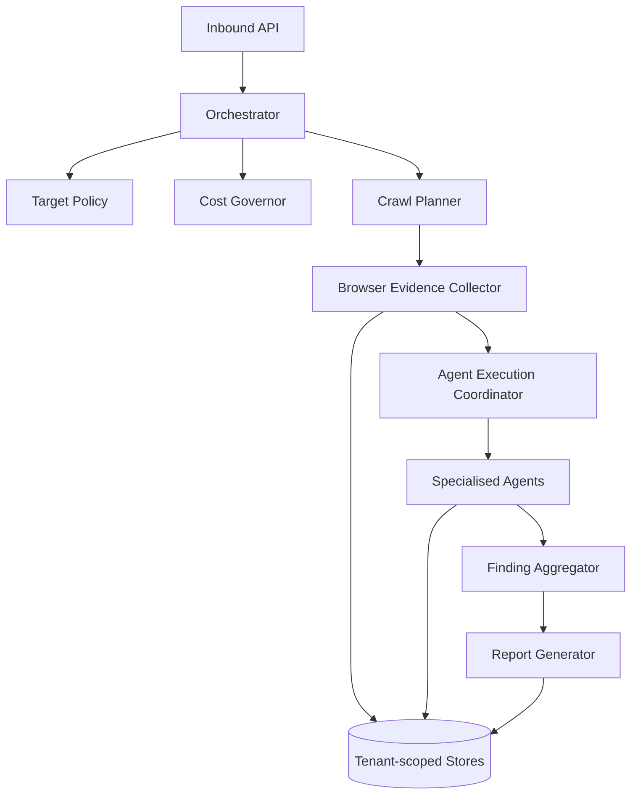

# Agent Architecture
## AI Website Health Orchestrator Agent

| Field | Value |
|---|---|
| Document ID | ORCA-AGENT-007 |
| Version | 0.1 |
| Status | Approved |
| Scope | Read-only Website Analysis MVP |
| Upstream | `04_High_Level_Design.md`, `05_Low_Level_Design.md`, `06_API_Specification.md` (Approved) |
| Downstream | `08_Database_Design.md`, `09_AI_Architecture.md`, `10_Security.md`, `11_Guardrails.md`, `13_Testing_Strategy.md` |
| Last updated | 2026-08-06 |

---

## 1. Purpose and principles

This document defines agent responsibilities, contracts, execution topology, browser-sharing rules, parallelism, retries, permissions, and failure isolation.

1. Agents are orchestrated workers, not an autonomous conversational swarm.
2. The Orchestrator owns workflow state; agents cannot schedule arbitrary work.
3. Deterministic tools and browser observations are primary evidence.
4. Every finding references evidence.
5. Agents are stateless between tasks; durable state uses approved ports.
6. Tool/vendor payloads never cross into domain contracts.
7. All collaborators are dependency-injected.
8. No agent can modify websites, repositories, infrastructure, or deployments.

---

## 2. Logical topology

The Orchestrator is an application service. It may use assistive AI through a port, but its lifecycle and policy decisions are deterministic.

---

## 3. Agent catalog

| Agent | Single responsibility | Primary input | Required ports |
|---|---|---|---|
| SEO | Metadata, headings, structured/social data | Shared page snapshot | `HtmlAnalysisPort`, `PageEvidenceRef` |
| Performance | Lighthouse metrics and optimization signals | Page URL/profile | `LighthousePort`, optional `PsiPort` |
| Latency | DNS/TLS/TTFB/document/resource timing | Network timeline | `HeaderProbePort`, `BrowserPort` |
| Broken Link | Internal/external status, redirects, missing resources, malformed URLs under probe budget | Extracted links | `LinkCheckPort` |
| Console | JS errors, rejected promises, failed loads, warnings | Console events | `PageEvidenceRef` from `BrowserPort` |
| HTML Document | Structure, semantics, forms, language, viewport | HTML snapshot | `HtmlAnalysisPort` |
| Security | Client-side secret patterns, mixed content, forms, headers | HTML/assets/headers | `SecretScanPort`, `HeaderProbePort` |
| Accessibility | Basic automated accessibility violations | Rendered page target | `AxePort` |

Report generation, target policy, crawling, and cost governance are services—not specialised analysis agents.

---

## 4. Shared contracts

### 4.1 `AgentTask`

| Field | Type | Rule |
|---|---|---|
| `task_id` | UUID | Unique per execution attempt lineage |
| `run_id` | UUID | Correlation and ownership |
| `tenant_id` | Opaque ID | Derived from authenticated context |
| `agent_name` | Agent enum | Must be enabled in applied preferences |
| `page_target` | `PageTarget` | Policy-approved URL/depth |
| `page_evidence` | `PageEvidenceRef` | Optional only when agent acquires its own approved tool evidence |
| `scan_preferences` | Effective preferences | Immutable for task |
| `deadline_at` | UTC timestamp | Must not exceed run deadline |
| `attempt` | Integer | Starts at one; bounded by Retry Policy |

### 4.2 `AgentResult`

| Field | Type | Rule |
|---|---|---|
| `task_id`, `run_id`, `agent_name` | IDs/enums | Match task |
| `page_url` | URL | Match approved target |
| `status` | `SUCCEEDED`, `FAILED`, `SKIPPED` | Terminal task result |
| `findings` | List of `Finding` | Each has evidence |
| `evidence` | List of `Evidence` | Sanitized summaries plus opaque refs |
| `artifacts` | List of `ArtifactRef` | Tenant-scoped; no internal path exposure |
| `warnings` | List of structured warnings | Non-terminal limitations |
| `failure` | Optional `AgentFailure` | Required for `FAILED` |
| `retry_count` | Integer | Executed retries |
| `started_at`, `finished_at` | UTC timestamps | Duration is derivable |

### 4.3 `AgentFailure`

| Field | Values / rule |
|---|---|
| `classification` | `TRANSIENT`, `PERMANENT`, `POLICY`, `BUDGET` |
| `code` | Stable machine-readable code |
| `message` | Safe, actionable, no secret/internal-network disclosure |
| `retryable` | True only for approved transient failures |

Port adapters translate vendor-native responses/exceptions into these contracts.

---

## 5. Evidence and finding rules

1. An agent must not return a finding without at least one evidence item.
2. Evidence contains `evidence_id`, kind, affected URL, sanitized summary, and optional artifact reference.
3. Raw console, DOM, header, or asset content is sanitized before persistence.
4. Screenshot and tool artifacts are immutable after storage.
5. Agents assign proposed severity/confidence; aggregation applies authoritative domain rules.
6. Confidence is `0.0`–`1.0`.
7. Duplicate findings are allowed at agent output; aggregator deduplicates them.
8. LLM text is not valid primary evidence.

---

## 6. Per-page execution flow

1. Coordinator checks run state, policy decision, budget, and deadline.
2. Browser Evidence Collector navigates once for the page/profile where reusable evidence is needed.
3. Collector persists immutable DOM, console, network, and permitted screenshot artifacts.
4. Coordinator creates tasks only for enabled agents with required inputs.
5. Independent agents execute concurrently under configured semaphores.
6. Each adapter classifies failures and returns a structured result.
7. Coordinator persists execution metadata and forwards results to aggregation.
8. Failed/skipped tasks become report limitations; successful findings remain usable.

Tool-specific agents may run separately when sharing a browser page would invalidate measurements (for example, Lighthouse).

---

## 7. Browser ownership and sharing

1. Browser contexts are tenant- and run-scoped; never shared across tenants.
2. Device profile is fixed for a context.
3. One component owns a mutable page handle at a time.
4. Agents share immutable `PageEvidence` snapshots/references, not mutable page objects.
5. Accessibility execution may use a coordinator-granted page lease through `AxePort`.
6. Console and network listeners attach before navigation.
7. Contexts close on run completion, cancellation by infrastructure, deadline, or fatal browser failure.
8. Authenticated target sessions are forbidden in MVP; change requires HLD amendment and Security approval.
9. Browser-pool size and lease timeout belong to Guardrails/Deployment.

---

## 8. Parallelism and scheduling

| Level | Parallelism rule |
|---|---|
| Runs | Isolated by tenant/run and global capacity |
| Pages | Parallel only within browser/cost limits |
| Agents | Parallel when inputs are immutable and no mutable page is shared |
| Tool calls | Governed independently for Lighthouse, PSI, axe, links, and LLM |

The coordinator uses bounded queues and semaphores. It must:

- reserve the initial run cost envelope before crawl planning;
- stop scheduling after a run becomes terminal;
- check budget before each task/tool reservation;
- preserve completed results when capacity decreases;
- avoid unbounded task creation;
- emit progress counters matching the API contract.

Exact concurrency values are configuration owned by `11_Guardrails.md`.

---

## 9. Retry and timeout semantics

1. Only failures classified `TRANSIENT` may retry.
2. Policy/budget/permanent failures never retry.
3. Retry count, backoff, jitter, task timeout, and run timeout are configured—not hardcoded.
4. Retried tasks retain lineage and produce one terminal `AgentResult`.
5. Side effects are limited to idempotent metadata/artifact writes.
6. Exhausted retries return `FAILED` with a report limitation.
7. Artifact-store failure is fatal when evidence/report integrity cannot be guaranteed.

Defaults are defined in `11_Guardrails.md`.

---

## 10. Failure isolation and run outcome

| Condition | Outcome |
|---|---|
| One agent/page fails; usable evidence exists | Continue; report limitation |
| Budget/deadline reached; usable findings exist | Stop new work; `PARTIAL` |
| No usable evidence after unrecoverable failure | `FAILED` |
| Target policy denies | `FAILED` before crawl |
| Report artifacts persist with gaps | `PARTIAL` |
| All planned work succeeds | `COMPLETED` |

The Orchestrator exclusively advances `ACCEPTED → VALIDATING → PLANNING → RUNNING → AGGREGATING → RENDERING → COMPLETED|PARTIAL`, with documented `FAILED` exits; agents never mutate `AnalysisRun`.

---

## 11. Permission boundaries

| Component | Allowed | Forbidden |
|---|---|---|
| Orchestrator | Plan, dispatch, persist metadata, aggregate, request reports | Bypass policy/budget; target mutation |
| Browser collector | GET/navigation, DOM/console/network capture, permitted screenshots | Upload/form submission, credential discovery, arbitrary script from page content |
| Analysis agents | Read approved evidence; invoke assigned read-only port | Schedule agents; direct report publication |
| Report Generator | Read normalized findings; render/store reports; optional LLM assist | Create evidence; modify findings authoritatively |
| LLM gateway | Explain/cluster supplied evidence-backed findings | Execute tools; alter policy, budgets, severity authority |

No VCS, shell, deploy, DNS, database-mutation, or production-write capability is exposed to agents.

---

## 12. Observability

Every task emits structured events with `tenant_id`, `scan_run_id`, `task_id`, `agent_name`, safe page URL, state, attempt, duration, finding count, and failure code. Query values, credentials, tokens, raw page content, and secrets are not logged.

Required metrics:

- tasks queued/running/succeeded/failed/skipped;
- duration and retry count by agent;
- browser/tool capacity utilization;
- findings by category/severity;
- policy, budget, and timeout denials.

---

## 13. Implementation layout

| Concern | Location |
|---|---|
| Shared domain contracts | `src/domain/` |
| Coordinator/use cases/DTOs | `src/application/` |
| Inbound/outbound interfaces | `src/ports/` |
| Specialised services | `src/application/orchestration/` or approved single-responsibility modules |
| Real tool adapters | `src/adapters/outbound/` |
| Dependency wiring | `src/bootstrap/` |

Rules:

1. `BrowserPort`, `LighthousePort`, and `AxePort` remain interfaces until real production adapters are implemented.
2. Placeholder/no-op adapters are forbidden.
3. Domain/application code never imports tool or AI SDKs.
4. Each agent module is independently testable through injected ports.

---

## 14. Required tests

Required suites: real-adapter contracts; fixture-based agent units; coordinator concurrency/failure/retry/deadline/budget tests; browser tenant/listener/lease/cleanup tests; evidence and masking tests; partial-report integration; and architecture dependency tests.

Coverage target is at least 90% for implemented agent/application modules.

---

## 15. Open downstream decisions

| Decision | Owner |
|---|---|
| Browser isolation, egress, page-script restrictions | `10_Security.md` |
| Concurrency, retries, timeouts, screenshot/tool budgets | `11_Guardrails.md` |
| Execution/artifact persistence schema | `08_Database_Design.md` |
| LLM prompts, providers, token accounting | `09_AI_Architecture.md` |
| Browser pool topology | `14_Deployment.md` |

---

## Document approval

| Role | Name | Decision | Date |
|---|---|---|---|
| Software Architecture | | Approved | 2026-08-06 |
| Engineering | | Approved | 2026-08-06 |
| AI Engineering | | Approved | 2026-08-06 |
| Security | | Approved | 2026-08-06 |
| QA | | Approved | 2026-08-06 |
| DevOps / Platform | | Approved | 2026-08-06 |
