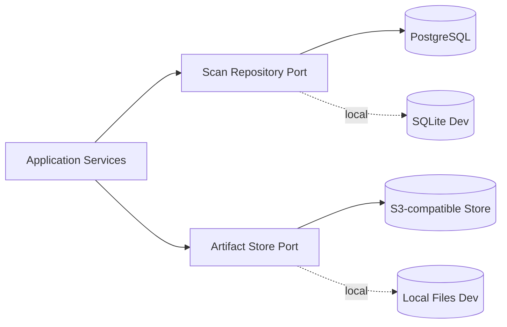
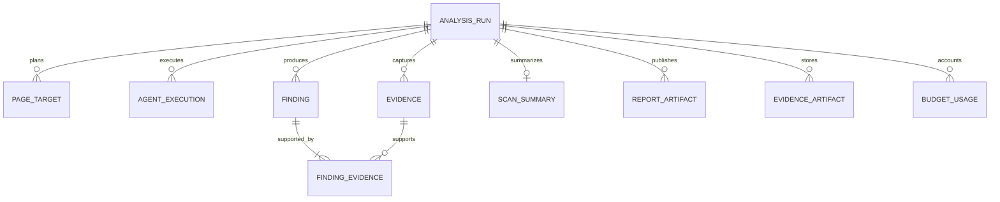

# Database Design
## AI Website Health Orchestrator Agent

| Field | Value |
|---|---|
| Document ID | ORCA-DB-008 |
| Version | 0.1 |
| Status | Approved |
| Scope | Read-only Website Analysis MVP |
| Upstream | `04_High_Level_Design.md`–`07_Agent_Architecture.md` (Approved) |
| Downstream | `10_Security.md`, `13_Testing_Strategy.md`, `14_Deployment.md` |
| Last updated | 2026-08-06 |

---

## 1. Purpose and decisions

This document defines persistence boundaries, logical schema, tenant isolation, transactions, immutability, retention, and local/production storage choices.

Normative decisions:

1. PostgreSQL is the production metadata database.
2. SQLite is permitted only for local development and isolated tests.
3. S3-compatible object storage is the production artifact store.
4. Local filesystem artifacts are permitted only for local development/tests.
5. Domain/application code depends only on `ScanRepositoryPort` and `ArtifactStorePort`.
6. Repository operations always require authenticated `tenant_id`.
7. Reports and evidence artifacts are immutable after publication.
8. Raw binaries/tool payloads are not stored in relational rows.

The local adapters must pass the same repository contract tests as production adapters.

---

## 2. Storage topology

Metadata stores opaque artifact references, checksums, media types, sizes, and retention timestamps. It never exposes physical paths through the API.

---

## 3. Tenant isolation model

1. `tenant_id` is an opaque identifier derived from authenticated context.
2. Every tenant-owned table contains `tenant_id`.
3. Child tables use composite foreign keys containing `tenant_id` and parent ID.
4. Every repository query predicates on `tenant_id`; ID-only lookups are forbidden.
5. PostgreSQL Row-Level Security is required as defense in depth.
6. Cross-tenant lookup returns no row and maps to API `404 RUN_NOT_FOUND`.
7. Object keys use `tenant_scope/run_id/artifact_id`; values are internal and never returned directly.
8. SQLite supports one isolated local tenant context only and is not production-safe.

Tenant identity and database-session claim mapping are finalized in `10_Security.md`.

---

## 4. Entity relationships

---

## 5. Logical schema

All timestamps are UTC. IDs are UUIDs. PostgreSQL JSON fields use `JSONB`; SQLite uses canonical JSON text.

### 5.1 `analysis_runs`

| Column | Type | Rule |
|---|---|---|
| `tenant_id`, `run_id` | Opaque ID, UUID | Composite primary identity |
| `target_url` | Text | Validated absolute HTTP(S), encrypted-at-rest policy downstream |
| `state` | Enum/text | `ACCEPTED`, `VALIDATING`, `PLANNING`, `RUNNING`, `AGGREGATING`, `RENDERING`, `COMPLETED`, `PARTIAL`, `FAILED` |
| `scan_preferences` | JSON | Immutable effective preference snapshot |
| `progress` | JSON | API progress counters |
| `coverage` | JSON | Discovered/eligible/scanned counts |
| `failure_code`, `failure_message` | Nullable text | Required for failed terminal outcome |
| `version` | Integer | Optimistic concurrency; starts at one |
| `created_at`, `updated_at` | Timestamp | Required |

Constraints: `(tenant_id, run_id)` unique; terminal states cannot transition; `version > 0`.

### 5.2 `page_targets`

| Column | Type | Rule |
|---|---|---|
| `tenant_id`, `page_target_id`, `run_id` | IDs | Tenant-scoped identity/FK |
| `url`, `normalized_url` | Text | Original and dedupe form |
| `depth` | Integer | Non-negative |
| `source_url` | Nullable text | Discovery source |
| `eligibility_status` | Enum | `ELIGIBLE`, `EXCLUDED`, `DENIED`, `LIMITED` |
| `status_reason` | Nullable text | Safe reason code/message |
| `created_at` | Timestamp | Required |

Unique eligible target: `(tenant_id, run_id, normalized_url, depth)`.

### 5.3 `agent_executions`

| Column | Type | Rule |
|---|---|---|
| `tenant_id`, `execution_id`, `run_id`, `task_id` | IDs | Task lineage |
| `page_target_id` | Nullable UUID | Null only for run-level task |
| `agent_name` | Enum | Approved agent |
| `status` | Enum | `SUCCEEDED`, `FAILED`, `SKIPPED` |
| `attempt`, `retry_count` | Integer | Non-negative |
| `failure_class`, `failure_code`, `failure_message` | Nullable text | Structured safe failure |
| `started_at`, `finished_at` | Timestamp | Required for terminal result |

Unique attempt: `(tenant_id, task_id, attempt)`.

### 5.4 `findings`

| Column | Type | Rule |
|---|---|---|
| `tenant_id`, `finding_id`, `run_id` | IDs | Tenant-scoped identity/FK |
| `agent_name`, `category` | Enum/text | Source and normalized category |
| `severity` | Enum | `critical`, `high`, `medium`, `low`, `info` |
| `confidence` | Decimal | `0.0`–`1.0` |
| `fingerprint` | Text | Stable dedupe identity |
| `title`, `description`, `impact`, `recommendation` | Text | Sanitized report content |
| `occurrence_count` | Integer | At least one |
| `priority_score` | Decimal | Domain-computed |
| `created_at` | Timestamp | Required |

Unique normalized finding: `(tenant_id, run_id, fingerprint)`.

### 5.5 `evidence` and `finding_evidence`

`evidence` contains `tenant_id`, `evidence_id`, `run_id`, `kind`, `affected_url`, sanitized `summary`, optional `artifact_id`, and `created_at`.

`finding_evidence` contains `tenant_id`, `finding_id`, `evidence_id`; its composite primary key prevents duplicate links. Deferred constraints ensure every committed finding has at least one evidence link.

### 5.6 Artifact metadata

| Table | Required columns |
|---|---|
| `evidence_artifacts` | tenant/run/artifact IDs, kind, object key, media type, size, SHA-256, status, created/retention timestamps |
| `report_artifacts` | tenant/run/artifact IDs, format, filename, object key, media type, size, SHA-256, ETag, created/retention timestamps |

Artifact status is `PENDING`, `AVAILABLE`, `DELETION_PENDING`, or `DELETED`. Available reports are immutable; `COMPLETED`/`PARTIAL` requires one available HTML and one Markdown report per tenant/run.

### 5.7 `scan_summaries` and `budget_usage`

`scan_summaries` contains one row per run: health score, executive summary, grouped counts, limitations/errors JSON, generated timestamp, and summary version.

`budget_usage` contains tenant/run ID, resource type, reserved amount, consumed amount, unit, and update timestamp. Resource types/defaults are defined in Guardrails.

---

## 6. Indexes

| Table | Index |
|---|---|
| `analysis_runs` | `(tenant_id, created_at DESC)`, `(tenant_id, state, updated_at)` |
| `page_targets` | `(tenant_id, run_id, eligibility_status)` |
| `agent_executions` | `(tenant_id, run_id, agent_name, status)` |
| `findings` | `(tenant_id, run_id, severity, priority_score DESC)`, fingerprint unique |
| `evidence` | `(tenant_id, run_id, kind)` |
| artifacts | `(tenant_id, run_id, status)`, checksum where dedupe is allowed |

Indexes must support documented API reads without cross-tenant scans.

---

## 7. Transaction boundaries

1. **Create run:** insert `analysis_runs` with effective preferences.
2. **Publish plan:** insert page targets and update run state/progress atomically.
3. **Complete agent task:** upsert terminal execution, insert evidence/findings/links, then increment progress in one transaction.
4. **Aggregate:** lock run by tenant/run/version; update normalized findings and summary.
5. **Publish report:** write object first as `PENDING`; verify checksum; transactionally insert/mark `AVAILABLE` rows and transition run.
6. **Artifact failure:** delete/orphan-clean object; do not expose metadata as available.

Optimistic updates use `WHERE tenant_id=? AND run_id=? AND version=?`; zero updated rows means concurrency conflict.

---

## 8. Immutability and consistency

1. Findings/evidence are append-oriented during collection.
2. Aggregation may replace normalized findings only before report publication.
3. Once a report is `AVAILABLE`, its object key, checksum, content, filename, and format cannot change.
4. API ETag equals the immutable report checksum representation.
5. Database state is source of truth for availability; object storage is source of truth for binary content.
6. No distributed transaction is required; pending states and reconciliation provide consistency.

---

## 9. Retention and deletion

1. Every artifact row has `retention_until`.
2. A scheduled cleanup process marks eligible rows `DELETION_PENDING`, deletes objects idempotently, then marks metadata `DELETED`.
3. Metadata retention may differ from artifact retention as defined in Security.
4. Legal hold, user deletion, and raw evidence package export are outside MVP unless later approved.
5. Cleanup logs tenant/run/artifact IDs but never artifact content.

---

## 10. Migration and operations

1. Schema changes use versioned, forward-only migrations reviewed with application changes.
2. Alembic is the Python migration tool for PostgreSQL and SQLite-compatible changes.
3. Destructive migrations require backup/restore validation and separate approval.
4. Production startup does not auto-run migrations.
5. Backup, restore, encryption, connection pooling, and high availability are finalized in Deployment/Security.

---

## 11. Repository contracts

`ScanRepositoryPort` operations require `tenant_id` and support:

- create/get/update run with optimistic version;
- persist/list page targets;
- record agent results transactionally;
- persist/load findings, evidence, and summary;
- register/resolve immutable report metadata;
- update progress and terminal outcome.

`ArtifactStorePort` supports immutable put, verified get, metadata/head, and idempotent delete by opaque object key. Adapters return structured errors and never physical local paths to application/API layers.

---

## 12. Required tests

Required suites: repository contract tests against SQLite and PostgreSQL; tenant isolation and RLS tests; transaction rollback/concurrency tests; evidence-link invariant tests; artifact checksum/immutability tests; pending-object reconciliation; retention cleanup idempotency; and migration upgrade tests.

Minimum coverage target is 90% for repository and artifact-store application/adapters.

---

## 13. Implementation reconciliation

The existing SQLite JSON-blob repository and direct filesystem path returns conflict with this design. After approval:

1. replace JSON-blob persistence with normalized repository records;
2. require tenant context on every operation;
3. add optimistic versioning and transactional result writes;
4. return opaque artifact references, never filesystem paths;
5. add production PostgreSQL/S3 adapters only when implemented fully—no placeholders.

---

## 14. Open downstream decisions

| Decision | Owner |
|---|---|
| Retention durations, encryption, tenant claim mapping | `10_Security.md` |
| Resource units and budget defaults | `11_Guardrails.md` |
| PostgreSQL/S3 deployment sizing, backup, HA | `14_Deployment.md` |
| Cost/storage lifecycle optimization | `15_Cost_Optimization.md` |

---

## Document approval

| Role | Name | Decision | Date |
|---|---|---|---|
| Software Architecture | | Approved | 2026-08-06 |
| Data Engineering | | Approved | 2026-08-06 |
| Engineering | | Approved | 2026-08-06 |
| Security | | Approved | 2026-08-06 |
| DevOps / Platform | | Approved | 2026-08-06 |
| QA | | Approved | 2026-08-06 |
