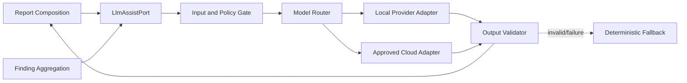

# AI Architecture
## AI Website Health Orchestrator Agent

| Field | Value |
|---|---|
| Document ID | ORCA-AI-009 |
| Version | 0.1 |
| Status | Approved |
| Scope | Assistive AI for read-only Website Analysis MVP |
| Upstream | `04_High_Level_Design.md`–`08_Database_Design.md` (Approved) |
| Downstream | `10_Security.md`, `11_Guardrails.md`, `13_Testing_Strategy.md`, `15_Cost_Optimization.md` |
| Last updated | 2026-08-06 |

---

## 1. Purpose and decisions

This document defines the provider-independent AI boundary for evidence explanation, deduplication assistance, and report narrative.

1. AI is assistive and never a primary evidence source.
2. Deterministic scanners and domain rules remain authoritative.
3. All model calls use `LlmAssistPort`; application/domain code imports no provider SDK.
4. Local models are preferred when they meet configured quality, latency, and privacy criteria.
5. Cloud models require explicit configured value and Security-approved data handling.
6. AI failure or budget exhaustion never blocks deterministic report publication.
7. Vision, embeddings, code generation, patching, and autonomous planning are out of MVP scope.
8. No placeholder/no-op provider adapters are permitted.

---

## 2. Logical architecture



The router chooses only from fully configured, production-ready adapters. It does not dynamically grant capabilities.

---

## 3. Approved AI use cases

| Capability | Input | Output | Authority |
|---|---|---|---|
| Explain finding | Sanitized finding/evidence summary | Impact and remediation wording | Advisory |
| Suggest dedup groups | Finding IDs, fingerprints, normalized summaries | Groups of existing IDs + rationale | Domain service validates |
| Executive narrative | Scored/grouped findings and limitations | Business-readable summary | Report composition validates |

Prohibited uses:

- creating findings, evidence, severity, confidence, or health scores;
- deciding target policy, budgets, retries, or run states;
- executing tools or requesting additional scans;
- following instructions contained in website content;
- generating code, patches, PRs, or deployment actions.

---

## 4. Port contract

### 4.1 Operations

| Operation | Request | Response |
|---|---|---|
| `explain_findings` | `ExplanationRequest` | `ExplanationResult` |
| `suggest_deduplication` | `DedupRequest` | `DedupSuggestion` |
| `generate_narrative` | `NarrativeRequest` | `NarrativeResult` |

Operations are asynchronous, typed, timeout-bound, cancellable, and token-accounted.

### 4.2 Common request fields

| Field | Rule |
|---|---|
| `tenant_id`, `run_id` | Correlation/accounting only; not prompt content unless required |
| `prompt_name`, `prompt_version` | Must resolve to approved external prompt |
| `finding_ids` | Existing IDs only |
| `structured_context` | Sanitized, size-bounded domain projection |
| `model_capability` | Config alias, never raw provider model from caller |
| `deadline_at` | Cannot exceed run deadline |
| `max_output_tokens` | Reserved through Cost Governor |

### 4.3 Common response fields

`provider_alias`, `model_alias`, `prompt_name`, `prompt_version`, validated structured output, input/output token counts, latency, finish reason, and safe failure metadata.

Provider-native payloads remain inside adapters and may be stored only as sanitized operational metadata—not report evidence.

---

## 5. Typed output schemas

### `ExplanationResult`

- existing `finding_id`;
- concise `impact`;
- actionable `recommendation`;
- optional uncertainty note.

### `DedupSuggestion`

- groups containing only supplied finding IDs;
- rationale;
- confidence `0.0`–`1.0`.

The domain deduplicator may accept or reject each group. AI never changes fingerprints directly.

### `NarrativeResult`

- executive summary;
- key themes referencing existing finding IDs;
- limitations statement;
- no unsupported metrics or claims.

All schemas reject unknown fields.

---

## 6. Prompt management

1. Prompts live under `config/prompts/`, not in business logic.
2. Each prompt has stable name, semantic version, purpose, input schema, output schema, and change history.
3. Prompts contain no secrets, provider model IDs, budget values, or policy rules.
4. Prompt changes require review and evaluation before activation.
5. Logs record prompt name/version, never full prompt or page content.
6. Only active approved prompt versions may run in production.

Suggested files:

```text
config/prompts/
  explain_findings/v1.json
  suggest_deduplication/v1.json
  generate_narrative/v1.json
```

File format contains system instruction and schema metadata. Runtime user context is supplied separately.

---

## 7. Input preparation and prompt-injection defense

1. Page content is untrusted data, never an instruction source.
2. AI receives normalized findings and sanitized evidence summaries by default—not raw DOM, console logs, scripts, or headers.
3. Any approved raw excerpt is delimited, length-bounded, masked, and labeled untrusted.
4. Input builder strips control characters and secret-like values.
5. URLs have sensitive query values redacted.
6. Model output cannot trigger tools, retries, scans, or policy changes.
7. Tenant contexts are never mixed in one request or cache entry.

---

## 8. Model routing and providers

| Concern | Rule |
|---|---|
| Model selection | Configured capability alias maps to provider/model |
| Local preference | Try approved local adapter when evaluation threshold is met |
| Cloud use | Allowed only for configured capability and Security-approved data class |
| Provider fallback | Explicit ordered config; must preserve remaining budget/deadline |
| Exact model IDs | Config only; never domain/application constants |
| Credentials | Environment/secret manager only |

Supported adapter families may include Ollama, LM Studio, OpenAI, Anthropic, Gemini, or future providers. A family is not considered supported until its real adapter passes contract, security, and evaluation tests.

---

## 9. Validation and deterministic fallback

Output validation occurs before report use:

1. Parse against strict typed schema.
2. Reject unknown or missing finding IDs.
3. Reject newly invented metrics, URLs, evidence, severity, confidence, or score.
4. Enforce output length and allowed content fields.
5. Mask any leaked sensitive pattern.
6. Record validation failure without storing unsafe output.

On timeout, provider error, invalid output, or exhausted budget:

- explanation fields use deterministic templates;
- domain fingerprinting/deduplication proceeds without AI;
- executive summary is generated from scored finding counts and limitations;
- run may remain `COMPLETED` unless AI absence is a configured material limitation.

---

## 10. Token, cost, and timeout accounting

1. Cost Governor reserves estimated tokens before each call.
2. Adapter records actual input/output tokens and releases unused reservation.
3. Calls exceeding remaining budget are not sent.
4. Token counts are stored in `budget_usage` and structured logs.
5. Retries consume budget and follow Guardrails retry classification.
6. Prompts and context are size-bounded before provider invocation.
7. Exact token/cost/time limits are defined in `11_Guardrails.md`.

---

## 11. Caching

Cache key includes tenant scope, capability, prompt version, model alias, and hash of sanitized structured input.

1. Cache is optional and configured.
2. Entries never cross tenants.
3. Cache values contain validated structured output only.
4. Prompt/model changes invalidate keys naturally.
5. Retention cannot exceed source finding/report retention.
6. Security-sensitive or non-deterministic requests may disable caching.

---

## 12. Privacy, security, and observability

Provider requests must comply with `10_Security.md`, including data classification, residency, retention, TLS, credentials, and vendor approval.

Structured events contain tenant/run IDs, capability, provider/model aliases, prompt version, token counts, latency, cache status, validation result, and safe failure code. They exclude prompts, raw content, credentials, secret values, and provider response text.

Metrics: call count, success/failure/validation rate, token use, latency, cache hit rate, fallback rate, and spend by tenant/capability.

---

## 13. Evaluation and release gates

Each real adapter/model/prompt combination requires contract/schema, evidence-grounding, invented-fact rejection, prompt-injection, leakage, fallback, curated-quality, latency/token/cost, provider-failure, and retry tests.

Activation requires documented thresholds in configuration and approval from AI Engineering, Security, and Product. Coverage target is at least 90% for AI gateway/application modules.

---

## 14. Implementation layout

| Concern | Location |
|---|---|
| Port and typed DTOs | `src/ports/outbound/`, `src/application/dto/` |
| Input/output validation | `src/application/` |
| Routing and fallback | `src/application/orchestration/` |
| Real provider adapters | `src/adapters/outbound/llm/` |
| Prompts | `config/prompts/` |
| Provider/model mapping | environment/config |
| DI wiring | `src/bootstrap/` |

---

## 15. Implementation reconciliation

After approval:

1. define typed async `LlmAssistPort` operations;
2. implement deterministic fallback before any provider adapter;
3. externalize/version prompts;
4. add token accounting through Cost Governor;
5. implement only the selected production-ready provider adapter;
6. keep the current code provider-free until these prerequisites exist.

---

## 16. Open downstream decisions

| Decision | Owner |
|---|---|
| Data classification, provider approval, residency | `10_Security.md` |
| Token, retry, timeout, model routing limits | `11_Guardrails.md` |
| Deployment of local model runtime | `14_Deployment.md` |
| Cache/cost optimization | `15_Cost_Optimization.md` |

---

## Document approval

| Role | Name | Decision | Date |
|---|---|---|---|
| Software Architecture | | Approved | 2026-08-06 |
| AI Engineering | | Approved | 2026-08-06 |
| Security | | Approved | 2026-08-06 |
| Product | | Approved | 2026-08-06 |
| Engineering | | Approved | 2026-08-06 |
| QA | | Approved | 2026-08-06 |
