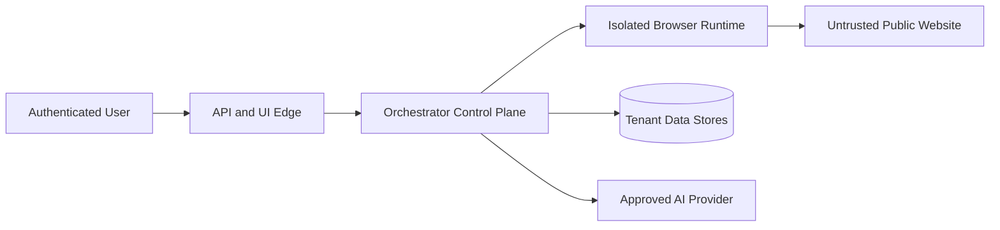

# Security Architecture
## AI Website Health Orchestrator Agent

| Field | Value |
|---|---|
| Document ID | ORCA-SEC-010 |
| Version | 0.1 |
| Status | Approved |
| Scope | Read-only Website Analysis MVP |
| Upstream | `04_High_Level_Design.md`–`09_AI_Architecture.md` (Approved) |
| Downstream | `11_Guardrails.md`, `13_Testing_Strategy.md`, `14_Deployment.md` |
| Last updated | 2026-08-06 |

---

## 1. Security objectives and scope

1. Prevent SSRF and access to private/internal infrastructure.
2. Isolate tenants, runs, browsers, metadata, artifacts, and reports.
3. Treat website/model content as untrusted.
4. Prevent credentials, secrets, and sensitive content from entering logs/reports.
5. Enforce read-only scanning and least privilege.
6. Protect data in transit and at rest.
7. Retain captured data only for configured business need.

MVP scans public, unauthenticated HTTP(S) websites only. Site credentials, source repositories, shell access, patches, deploys, DNS, and infrastructure mutation are out of scope.

---

## 2. Trust boundaries

| Boundary | Primary risk | Required control |
|---|---|---|
| User → Edge | Spoofing/tenant access | OIDC JWT validation and authorization |
| Edge → Control | Tampering/confused deputy | Typed DTOs; server-derived tenant |
| Control → Target | SSRF/egress abuse | Target Policy Gate + network deny |
| Target → Browser | Malicious scripts/downloads | Isolated browser sandbox |
| Target → AI/report | Prompt injection/XSS/secrets | Sanitization, schema validation, escaping |
| Control → Data | Cross-tenant disclosure | Tenant predicates + PostgreSQL RLS |

---

## 3. Authentication and authorization

### 3.1 Authentication

API authentication uses OIDC-issued bearer JWTs. Middleware must validate:

- signature using trusted rotating JWKS;
- configured issuer and audience;
- expiration and not-before;
- explicit algorithm allowlist;
- token type and required subject/tenant claims.

Tokens are never logged, persisted, placed in URLs, or forwarded to targets/providers.

### 3.2 Tenant and roles

`tenant_id` is derived from a configured immutable token claim. Client-supplied tenant IDs are rejected/ignored.

| Role | Submit scan | Read status/preview/download |
|---|---|---|
| `scan_operator` | Yes | Yes |
| `scan_viewer` | No | Yes |

Authorization always evaluates `(tenant_id, run_id)`. Cross-tenant and unauthorized resource access returns `404`, not `403`, to avoid existence disclosure.

Local development may use an explicit development identity adapter only outside production; it must never be enabled by default in deployed environments.

---

## 4. Target Policy Gate and SSRF protection

Every initial URL, redirect target, discovered page, resource probe, and API request target is validated before connection.

### 4.1 URL validation

1. Allow only `http` and `https`.
2. Reject userinfo, fragments for network identity, malformed hosts, non-approved ports, and non-canonical encodings.
3. Normalize internationalized domains and compare canonical host/scheme/port.
4. Apply configured domain allow/deny rules.
5. Enforce crawl origin/scope from Guardrails.

### 4.2 Address validation

Resolve all A/AAAA answers through the controlled resolver and reject any address classified as:

- loopback, unspecified, private, link-local, multicast, reserved, or documentation/test range;
- cloud/provider metadata or platform-control endpoint;
- internal service discovery or local host alias.

Validation must cover IPv4, IPv6, IPv4-mapped IPv6, integer/hex/octal forms, and DNS aliases.

### 4.3 DNS rebinding and redirects

1. Revalidate DNS and policy before every connection and redirect.
2. Pin the approved resolved address for the connection where the HTTP/browser stack permits.
3. Verify the connected peer address matches an approved answer.
4. Reject redirects that change to a denied host/scheme/port.
5. Bound redirect count in Guardrails.
6. Cache only deny-safe DNS decisions for a short configured duration.

Application validation is mandatory but not sufficient: runtime egress policy blocks private/link-local/metadata networks independently.

---

## 5. Browser isolation

1. Browsers run in isolated, non-privileged workloads with no host filesystem mounts.
2. Contexts are tenant/run-scoped and destroyed at terminal state/deadline.
3. Downloads, file uploads, clipboard, geolocation, notifications, camera, microphone, USB, and persistent storage are disabled.
4. Browser traffic uses controlled DNS/egress only.
5. Page handles are not shared concurrently; immutable evidence references are shared.
6. Browser crash/escape is treated as a security event and fails affected work.
7. Container/OS sandbox controls must not be disabled for convenience.
8. Authenticated target sessions and arbitrary page-defined actions are forbidden in MVP.

---

## 6. Read-only enforcement

The scanning runtime permits navigation and read-oriented `GET`/`HEAD` operations. It must not intentionally submit forms, upload files, invoke mutation APIs, click destructive controls, or execute instructions extracted from content.

Requests with mutation methods discovered in pages are recorded as metadata only and not replayed. No VCS, CI/CD, shell, cloud-control, database-write, or deployment credentials are available to agents.

---

## 7. Data classification and minimization

| Class | Examples | Handling |
|---|---|---|
| Public | Target public URL, public metadata | Tenant-scoped; normal encryption |
| Internal | Run state, findings, metrics | Tenant authorization required |
| Sensitive | DOM, screenshots, console/network excerpts | Minimize, mask, short retention |
| Restricted | Tokens, credentials, detected secrets | Never persist plaintext; redact immediately |

Capture only evidence needed for a finding or documented coverage. Avoid request/response bodies, cookies, storage, and full asset contents unless an approved analyzer requires a bounded sanitized excerpt.

---

## 8. Secret and privacy masking

1. Masking occurs before persistence, logging, AI calls, preview, and report rendering.
2. Use configured pattern and entropy rules with allowlisted false-positive handling.
3. Preserve safe context while replacing value with `[REDACTED]`.
4. URL query values are removed or replaced; parameter names may remain when safe.
5. Headers such as authorization, cookies, API keys, and set-cookie are always removed.
6. Raw restricted values are not retained for debugging.
7. Masking failure quarantines affected evidence/finding; safe remaining evidence may publish as `PARTIAL`, but no report publishes unless all included content passes masking.

---

## 9. Secure API and UI

1. TLS is mandatory outside local development.
2. Strict request schemas reject unknown fields; body/header sizes are bounded.
3. CORS uses an explicit configured origin allowlist—never wildcard with credentials.
4. Bearer-token APIs do not use cookie authentication; CSRF-bearing state is not introduced.
5. Correlation IDs are validated and regenerated when malformed.
6. Errors expose stable codes but no stack traces, SQL, paths, network addresses, or policy details.
7. Security headers include HSTS, `X-Content-Type-Options: nosniff`, referrer policy, and restrictive frame policy.

---

## 10. Safe report generation and download

1. All report fields are escaped for their output context.
2. HTML reports contain no scripts, external resources, forms, or active content.
3. Self-contained HTML uses restrictive CSP: `default-src 'none'; img-src data:; style-src 'unsafe-inline'`.
4. Downloads use attachment disposition, approved media type, checksum ETag, and tenant authorization.
5. Filenames are generated from sanitized domain/timestamp only.
6. Markdown content is escaped/sanitized to prevent embedded active HTML.
7. Internal object keys and filesystem paths are never exposed.

---

## 11. AI provider security

1. Only sanitized structured finding/evidence projections may leave the trust boundary.
2. Page content is untrusted data and cannot modify system instructions.
3. Cloud transmission requires approved provider, region/residency, retention policy, and data-processing terms.
4. Provider training/data retention must be disabled when supported and contractually prohibited otherwise.
5. Model credentials are scoped, rotated, and stored in a secret manager.
6. Local model endpoints bind to private runtime networks and require service authentication.

---

## 12. Data protection and tenant isolation

1. TLS protects service, database, object-store, and provider connections.
2. Managed encryption protects database, objects, backups, and snapshots at rest.
3. PostgreSQL queries include tenant predicates and RLS session context.
4. Object-store access uses private buckets, blocked public access, and workload identity.
5. Application downloads stream through authorization or use short-lived tenant-bound signed URLs.
6. Least-privilege identities separate API, workers, migration jobs, and retention cleanup.

---

## 13. Retention defaults

All values are named configuration, not code constants:

| Data | Default |
|---|---|
| DOM/screenshots/raw tool artifacts | `ARTIFACT_RETENTION_DAYS=7` |
| HTML/Markdown reports | `REPORT_RETENTION_DAYS=30` |
| Run/findings metadata | `METADATA_RETENTION_DAYS=90` |
| Application logs | `LOG_RETENTION_DAYS=30` |
| Security audit events | `SECURITY_AUDIT_RETENTION_DAYS=365` |

Tenant policy may shorten retention. Extensions require documented business/legal approval. Cleanup follows the idempotent deletion design in `08_Database_Design.md`.

---

## 14. Secrets and supply chain

1. Secrets come only from environment-injected secret-manager references.
2. No credentials exist in source, config files, prompts, images, logs, or test fixtures.
3. Dependencies are version-controlled through lock artifacts, vulnerability-scanned, and updated through reviewed changes.
4. Build artifacts include an SBOM and provenance where supported.
5. Production images run read-only, non-root, minimally packaged, and scanned before release.

---

## 15. Security observability and response

Audit events include authentication failures, authorization denials, target-policy denials, cross-tenant attempts, budget abuse, masking failures, browser isolation failures, and secret detections. Events contain safe IDs/codes—not sensitive content.

High-confidence isolation escape, credential exposure, or cross-tenant disclosure triggers run termination, credential revocation where relevant, artifact quarantine, and incident response escalation.

---

## 16. Required security tests

Required suites: OIDC/JWT validation; role/tenant authorization; RLS/object isolation; SSRF bypass corpus including IPv6/rebinding/redirects; egress-deny integration; browser permission/sandbox tests; secret/PII masking; prompt injection; XSS/report sanitization; signed-download authorization; retention cleanup; dependency/image scanning; and no-secret static checks.

Security tests are release-blocking. Implemented security modules target at least 90% coverage.

---

## 17. Implementation reconciliation

After approval:

1. replace the provisional hostname blocklist with the complete Target Policy Gate;
2. derive tenant context from authenticated identity and require it on repositories;
3. remove physical artifact paths from application/API responses;
4. add security middleware, safe errors, report sanitization, and audit events;
5. keep browser/tool adapters absent until isolation controls are deployable and tested.

---

## 18. Open downstream decisions

| Decision | Owner |
|---|---|
| Numeric concurrency/rate/budget limits | `11_Guardrails.md` |
| Runtime network policy and secret-manager products | `14_Deployment.md` |
| Storage/provider cost-driven retention adjustments | `15_Cost_Optimization.md` |

---

## Document approval

| Role | Name | Decision | Date |
|---|---|---|---|
| Security Architecture | | Approved | 2026-08-06 |
| Software Architecture | | Approved | 2026-08-06 |
| Engineering | | Approved | 2026-08-06 |
| DevOps / Platform | | Approved | 2026-08-06 |
| AI Engineering | | Approved | 2026-08-06 |
| QA | | Approved | 2026-08-06 |
