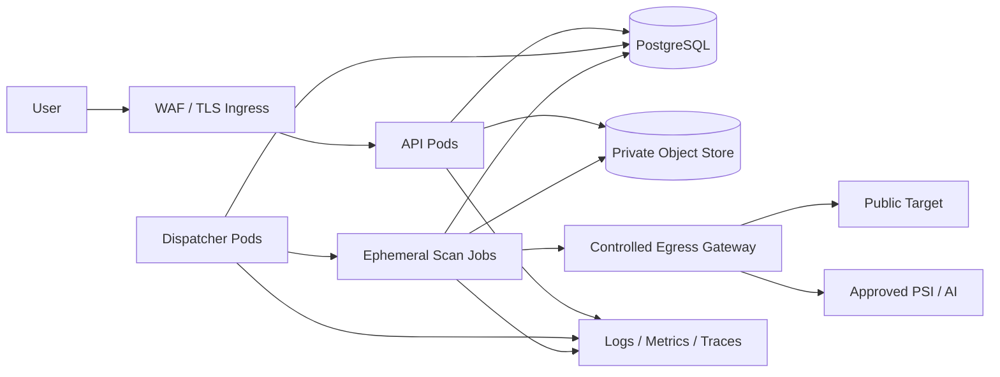

# Deployment Architecture
## AI Website Health Orchestrator Agent

| Field | Value |
|---|---|
| Document ID | ORCA-DEP-014 |
| Version | 0.1 |
| Status | Approved |
| Scope | Read-only Website Analysis MVP |
| Upstream | `04_High_Level_Design.md`–`13_Testing_Strategy.md` (Approved) |
| Downstream | `15_Cost_Optimization.md`, `16_Engineering_Backlog.md` |
| Last updated | 2026-08-06 |

---

## 1. Deployment goals

1. Isolate each run’s untrusted browser/tool execution.
2. Scale API and scan capacity independently.
3. Preserve accepted work and completed evidence across process failure.
4. Enforce network, identity, tenant, secret, and resource boundaries.
5. Promote one immutable build through environments.
6. Support safe migration, rollback, backup, restore, and retention.

Kubernetes is the production orchestration baseline. PostgreSQL/S3 requirements reaffirm approved `08_Database_Design.md`; SQLite/filesystem remain local-only.

---

## 2. Production topology

### Deployable units

| Unit | Responsibility | Scaling |
|---|---|---|
| `api` | Authentication, submit/status/preview/download | Stateless horizontal replicas |
| `dispatcher` | Claim queued runs, enforce global capacity, create/reconcile jobs | Lease-based active/standby replicas |
| `scan-worker` | One run: policy, crawl, agents, aggregation, reports | One ephemeral Kubernetes Job per run |
| `migration` | Forward-only Alembic schema changes | Explicit one-shot release Job |
| `retention` | Expire metadata/artifacts and reconcile pending objects | Scheduled single-leader Job |

HLD mapping: API hosts S1; dispatcher and scan-worker deploy S2 orchestration; scan-worker hosts logical S3–S13 and S15–S17 without merging their module responsibilities. Each unit uses distinct commands/privileges.

---

## 3. Durable dispatch decision

PostgreSQL is the durable MVP run/task queue; no separate broker is introduced.

1. Accepted/planned runs and agent executions are durable records from `08_Database_Design.md`.
2. Dispatchers claim eligible work with short leases and transactional row locking (`FOR UPDATE SKIP LOCKED`).
3. Claim includes worker/job ID, lease expiry, attempt, and application version.
4. Heartbeats extend leases; an expired lease is safely reclaimable.
5. State versioning and idempotent task/report keys prevent duplicate effects.
6. Worker termination preserves committed evidence; reconciliation resumes or finalizes per state.

This KISS choice is valid for MVP capacity. Broker adoption requires measured PostgreSQL queue contention and an ADR; application use cases must remain queue-provider independent.

---

## 4. Environment profiles

| Environment | Runtime | Data | Purpose |
|---|---|---|---|
| Local | Python/containers; single developer identity | SQLite + filesystem | Fast development/unit integration |
| CI | Ephemeral containers/cluster | PostgreSQL + S3-compatible test service | Deterministic gates |
| Staging | Kubernetes production topology | Isolated managed services | Migration, security, load, release validation |
| Production | Multi-zone Kubernetes + managed HA data | PostgreSQL + private object storage | Tenant workloads |

No production data or credentials are copied to lower environments. Staging uses synthetic fixtures and separate accounts, keys, domains, buckets, databases, and identity tenants.

---

## 5. Global capacity defaults

| Configuration | Production baseline |
|---|---:|
| `MAX_ACTIVE_RUNS_GLOBAL` | 10 |
| `MAX_QUEUED_RUNS_GLOBAL` | 100 |
| `MAX_BROWSER_CONTEXTS_GLOBAL` | 20 |
| `MAX_LIGHTHOUSE_TASKS_GLOBAL` | 5 |
| `MAX_PSI_CALLS_IN_FLIGHT_GLOBAL` | 10 |
| `MAX_LLM_CALLS_IN_FLIGHT_GLOBAL` | 5 |
| `MAX_REPORT_STREAMS_GLOBAL` | 20 |

These values compose with stricter per-tenant/run limits from Guardrails. Increases require capacity/load evidence. Admission stops before cluster/database saturation; queued work remains durable.

---

## 6. Baseline sizing and autoscaling

| Unit | Request | Limit | Replica/job baseline |
|---|---|---|---|
| API | 250m CPU / 512 MiB | 1 CPU / 1 GiB | min 2, max 10 |
| Dispatcher | 250m / 512 MiB | 1 CPU / 1 GiB | 2 replicas |
| Scan worker | 2 CPU / 2 GiB | 4 CPU / 4 GiB | 0–10 concurrent Jobs |
| Retention/migration | 250m / 512 MiB | 1 CPU / 1 GiB | one while active |

API scales on CPU and request rate. Worker admission scales from durable queue depth/oldest age while respecting global limits and available browser capacity. Dispatcher does not create a job without reserved capacity.

Production PostgreSQL baseline is managed multi-zone, at least 2 vCPU/8 GiB memory, encrypted storage with connection pooling and storage autoscaling. Final sizing follows staging load results.

---

## 7. Scan-job isolation

1. One job handles one tenant/run and exits after terminal/recoverable handoff.
2. Run as non-root with read-only root filesystem, dropped Linux capabilities, seccomp runtime default, and no privilege escalation.
3. Use an empty ephemeral working volume with size limit; wipe it on job deletion.
4. Browser sandbox remains enabled; browser process is destroyed with the job.
5. No host paths, container socket, service-account token auto-mount, or cluster API permission.
6. Apply CPU, memory, PID, ephemeral-storage, and execution-deadline limits.
7. Pod Security restricted profile and tenant/run labels are mandatory.
8. Tool/browser images contain no shell/cloud/VCS credentials.

---

## 8. Network architecture

Default-deny Kubernetes NetworkPolicies apply to ingress and egress.

| Workload | Allowed network paths |
|---|---|
| API | Ingress; PostgreSQL; object store; OIDC/JWKS; observability |
| Dispatcher | PostgreSQL; Kubernetes Job API; observability |
| Scan worker | PostgreSQL; object store; controlled DNS; egress gateway; observability |
| Migration/retention | PostgreSQL/object store as required; observability |

Public target and provider traffic leaves only through separate authenticated egress policies. The target path:

- permits approved public HTTP(S) ports only;
- resolves through controlled DNS;
- blocks private, link-local, metadata, cluster, control-plane, and service CIDRs;
- logs safe destination/policy decisions;
- cannot reach provider/admin endpoints.

PSI/AI egress is hostname/port allowlisted and cannot access arbitrary targets. Network controls complement, never replace, application Target Policy.

---

## 9. Identity and secrets

1. Human identity uses the approved OIDC flow from Security.
2. Workloads use short-lived Kubernetes/cloud workload identity—no static cloud keys.
3. Production secrets are stored in HashiCorp Vault (or an approved managed Vault-compatible service).
4. Vault Agent/CSI injects short-lived values as environment variables or memory-backed files.
5. Secrets never appear in images, manifests, Helm values, ConfigMaps, command lines, or CI artifacts.
6. Roles grant least privilege per deployable unit, environment, database schema, bucket prefix, and provider.
7. Rotation must not require an image rebuild and is tested in staging.

Local `.env` is developer-owned, ignored by VCS, and contains no shared/production credential.

---

## 10. Configuration

Non-secret configuration is versioned per environment and validated before readiness. Environment variables may override approved config; hard ceilings cannot be raised by request.

Each accepted run records policy/config version and effective limits. Dynamic emergency reductions use an audited configuration release; in-flight runs keep accepted values unless Security orders termination.

---

## 11. Data, backup, and disaster recovery objectives

### PostgreSQL

- managed multi-zone high availability and TLS;
- point-in-time recovery with RPO ≤ 15 minutes;
- daily backup retained 35 days;
- connection pool with per-workload credentials;
- quarterly restore test;
- target production RTO ≤ 4 hours.

### Object storage

- private bucket, blocked public access, encryption, versioning, and lifecycle rules;
- checksums verified on write/read;
- incomplete multipart uploads removed automatically;
- same-region multi-zone durability;
- restore/reconciliation test each quarter.

Reports/evidence are reconstructable only while source artifacts remain; database and object-store restore points must be aligned. Retention deletion is not undone outside an approved legal hold.

---

## 12. Database migration

1. Alembic migrations are forward-only, reviewed, tested from the prior production version, and run separately.
2. Production application startup never migrates.
3. Use expand → migrate/backfill → switch → contract across releases.
4. Acquire an advisory migration lock; only one migration job runs.
5. Destructive/long-lock changes require backup restore proof, maintenance plan, and approval.
6. App rollback supports at least the previous schema-compatible version.
7. Migration failure halts rollout; it does not automatically reverse schema.

---

## 13. Health and operational endpoints

Endpoints are outside `/api/v1` and expose no tenant/config/dependency details:

| Endpoint | Access | Meaning |
|---|---|---|
| `/health/live` | Cluster probe | Process/event loop alive; no dependency calls |
| `/health/ready` | Cluster probe | Config valid; required DB/object dependencies usable |
| `/metrics` | Internal authenticated network | Prometheus-format operational metrics |

Scan-job health comes from heartbeat/lease and Kubernetes Job status. External PSI/AI/target outages do not make the API unready; they affect run outcomes through documented fallback.

---

## 14. Observability

OpenTelemetry-compatible structured logs, metrics, and traces flow through a collector to environment-selected backends.

Required dimensions are bounded: environment, service, version, state, agent/tool, safe tenant/run IDs, outcome, and failure code. URLs, content, tokens, credentials, raw provider responses, and secret values are excluded.

Dashboards/alerts cover API errors/latency, queue depth/oldest age, active jobs, dispatch lease expiry, run outcomes/duration, browser/tool failure, database pool/locks, object errors, policy denials, budget exhaustion, and capacity.

---

## 15. Build and supply chain

1. CI builds minimal multi-stage OCI images from locked dependencies.
2. Browser/tool versions are explicit and identical across tested/promoted images.
3. Images run by digest, are vulnerability-scanned, generate SBOM/provenance, and are signed.
4. Critical/high exploitable findings block promotion unless Security grants a time-bounded exception.
5. Build once; promote the same digest through CI, staging, and production.
6. Production registry and deployment admission verify signatures.

---

## 16. Release and rollback

Release order: backup verification → expand migration → API/dispatcher canary → worker compatibility scan → controlled rollout → acceptance/smoke checks → full capacity.

1. API/dispatcher use rolling updates with availability budgets.
2. Worker jobs are immutable; existing jobs finish on their starting version unless security termination is required.
3. New dispatch can pause while accepted runs remain queued.
4. Rollback deploys the prior image/config; database schema is not automatically downgraded.
5. Failed/cancelled rollout preserves artifacts and reconciles leases/jobs.
6. Release evidence includes migrations, tests, image digests, config version, and approvals.

---

## 17. Required deployment tests

Required: manifest/policy validation; startup/readiness/liveness; workload identity and secret rotation; default-deny/SSRF egress; pod security and browser isolation; durable lease/reclaim/idempotency; global admission; autoscaling/fairness; rolling deploy with active jobs; migration upgrade/compatibility/failure; backup restore and artifact reconciliation; retention; node/pod/database/object-store fault injection; observability/alerts; signed-image admission.

Production readiness requires all Testing Strategy release gates plus a staging restore and rollback rehearsal.

---

## 18. Architectural decisions

| ID | Decision | Status |
|---|---|---|
| DEP-01 | Kubernetes production runtime | Accepted |
| DEP-02 | One isolated ephemeral scan Job per run | Accepted |
| DEP-03 | PostgreSQL durable queue; no MVP broker | Accepted |
| DEP-04 | Managed PostgreSQL + private S3-compatible store | Reaffirms approved DB design |
| DEP-05 | Vault-compatible production secret manager | Accepted |

---

## 19. Implementation reconciliation

After approval: add production adapters and manifests only when complete; introduce durable leases/dispatcher; split runtime commands/service accounts; add health/metrics; implement migrations/retention; lock/build/sign images; and create deployment/infrastructure tests. No placeholder production adapter or manifest is acceptable.

---

## Document approval

| Role | Name | Decision | Date |
|---|---|---|---|
| Software Architecture | | Approved | 2026-08-06 |
| DevOps / Platform / SRE | | Approved | 2026-08-06 |
| Security | | Approved | 2026-08-06 |
| Engineering | | Approved | 2026-08-06 |
| QA | | Approved | 2026-08-06 |
